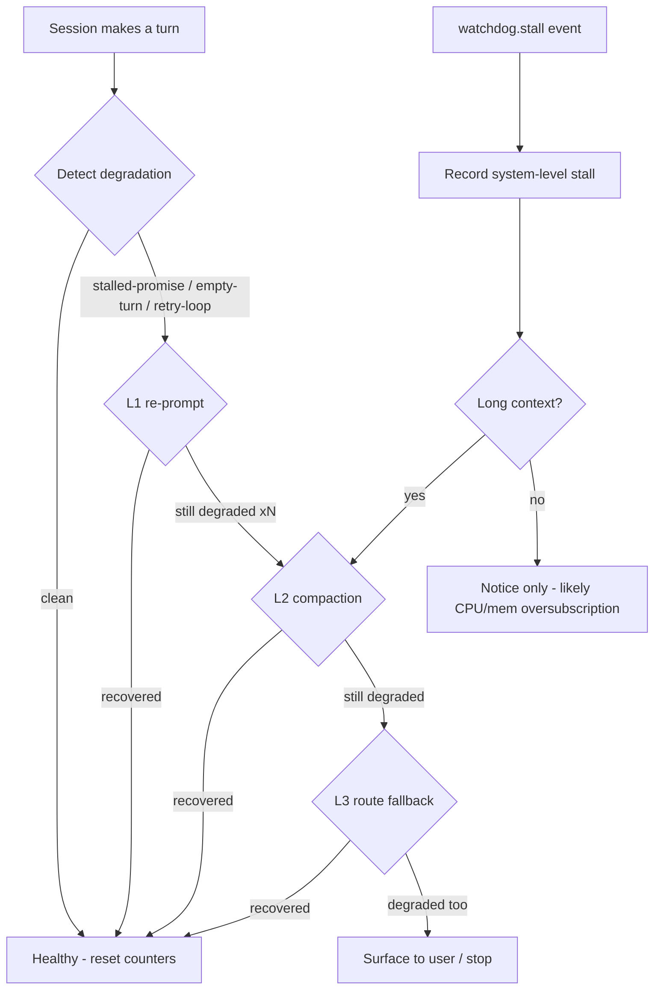

# Model Degradation Management Plan

## Status

**In progress.** Slice 1 (watchdog subscription surface) and Slice 2
(degradation tracker) landed on `feat/model-degradation-management`. The plan
proposes turning an existing but passive set of detection signals into an
active degradation-management system.

> **Trigger for this plan (2026-09):** a long-running session with a live
> language model degraded into a classic stalled-promise loop. The session
> stayed `Active`
> but made no forward progress — its last assistant message was several
> "Let me add the import…" filler turns with no tool call, and it left an
> in-flight, non-compiling edit behind. Nothing in the product
> noticed or reacted: the log recorded the stall, but no subscriber acted on
> it, and the session kept "continuing" without escalating or changing course.

## Purpose

Detect when a model session starts degrading (stalling, filler-looping, or
freezing), then automatically escalate through an escalating mitigation ladder —
re-prompt, compact, then route-fallback — instead of silently spinning and
leaving broken intermediate state behind.

At every rung the goal is the same: **stop the degradation before it wastes
tokens, wall-clock time, and the user's attention**, with a clear audit trail
and no destructive auto-actions taken without a user-visible notice.

## What already exists (building blocks — no new detection needed for the core signals)

The detection primitives below are already implemented, validated, and covered by
tests. This plan is largely about **wiring them together reactively**, not writing
new detectors.

| Signal | Location | Current behavior | Gap |
|---|---|---|---|
| `is_stalled_promise_text(text)` | `crates/jcode-app-core/src/agent/response_recovery.rs` | Detects the specific DeepSeek-V4-Flash degradation: dense "Let me grep … Let me run …" filler with no tool call. Doc comment names the exact observed offender. | Detection only — used in `turn_loops` to re-continue, but no cross-turn state or escalation. |
| `maybe_continue_stalled_promise(...)` + `stalled_promise_continuations` counter | `crates/jcode-app-core/src/agent/turn_loops.rs` | Re-injects a prompt and continues, bounded per turn. | Bound is per-turn and flat; no totalizer over the route, no compaction/fallback when repeats exceed a threshold. |
| `watchdog` (`beat`, `WorkGuard`, `watchdog.stall`/`recovered`/`alive`) | `crates/jcode-logging/src/watchdog.rs` | Process-level stall watchdog; logs a thread dump + resource snapshot when no beat arrives while work is in flight. | **Log-only.** No subscriber acts on `watchdog.stall`. |
| Session status marking | session persistence | Sessions record `Active` / `Crashed` etc. | A session that is `Active` but stalled is not distinguishable from a healthy `Active` one without external sampling. |
| `set-route-model` / route aliasing | provider/route layer | Can retarget a session onto a different model/route. | Manual only. Not invoked programmatically from degradation signals. |

**Conclusion of the audit:** the product is good at *detecting* stalls and
degradation but has **no feedback loop**. Every rung below is about closing that
loop.

---

## Design

### Layered model

Degradation is handled at three escalating levels. Each level has its own trigger,
action, and rollback, and is only entered once the levels below it have demonstrably
failed to restore forward progress.

### Core concepts

1. **Degradation state keyed by route.** A small persistence record keyed by
   `route_key` (provider + model + alias) accumulates recent degradation events:
   stall type, turn number, timestamp, and the active mitigation rung. This makes
   degradation a *property of the route/session over time*, not a one-shot flag.

2. **Threshold-driven promotion.** When the event count crosses a threshold (e.g.
   3 stalled-promise hits within N turns, or 2 `watchdog.stall` events within an
   hour while work was in flight), the session routes to the next mitigation rung.

3. **Mitigation ladder (only escalate on provable non-recovery):**
   - **Rung 1 — Re-prompt.** Inject a refocus/compression prompt and continue
     (reuses `maybe_continue_stalled_promise`). Low cost, no context loss.
   - **Rung 2 — Compaction.** Force a compaction of the transcript (the observed
     root cause of the DeepSeek degradation is very long context). Preserves
     intent, shrinks the context the model degrades under.
   - **Rung 3 — Route fallback.** Retarget the session to a pinned non-offending
     model/route. This is the rung that actually stops a repeating degradation
     loop. It is the **only destructive-ish step** and must be gated: a config
     flag, an allow-list of candidate fallback routes, and a user-visible notice
     (and by default a confirmation before switching away from an explicitly
     user-chosen model).

4. **System-level stall is a separate axis.** A `watchdog.stall` that coincides
   with high load / memory pressure (the `research/session-freeze` investigation)
   is CPU/mem oversubscription, not model degradation. It should surface a notice
   and suggest bounding concurrent work, **not** trigger a route switch. Route
   fallback only makes sense for turn-content degradation (stalled-promise /
   empty-turn / compact-unfulfilled-tool-request).

### Where the wiring lives

- **State:** a new degradation tracker (counters + current rung + persistence),
  alongside the existing per-session state. Suggested home: a small module under
  `crates/jcode-app-core/src/agent/` or `server/`, exposed through the relevant
  service handle, consistent with the service-split direction.
- **Detection: keep where it is** (`response_recovery.rs`, `turn_loops.rs`).
  Change the flat per-turn `stalled_promise_continuations` counter into a call
  into the degradation tracker so repeats are totalized across turns and escalated.
- **Watchdog subscription:** expose `watchdog.stall` / `watchdog.recovered` as a
  subscription surface (it is currently log-only) so app-core can record stalls and
  correlate them with load.
- **Alerting:** emit a `ServerEvent`-style notice (or TUI banner) on promotion to
  each rung so the degradation is visible, not just logged.

---

## Migration / implementation slices

Each slice must leave the tree compiling and the existing `jcode-app-core` and
`jcode-base` suites green.

### Slice 1 — Watchdog subscription surface (foundation, non-destructive)

- Add a way for app-core to subscribe to `watchdog.stall` / `watchdog.recovered`
  / `watchdog.alive` instead of the events being log-only.
- Add a test proving a subscriber receives the event when a real stalled thread
  emits it (extend the existing `jcode-logging/tests/watchdog_stall_probe.rs`).
- **Exit:** `jcode-logging` exposes a subscription API; app-core test verifies
  receipt; no behavior change for existing consumers.

### Slice 2 — Degradation state tracker

- Add a tracker keyed by route/session that accumulates stall-type events with
  timestamps and current rung.
- Wire the existing per-turn `stalled_promise_continuations` / re-prompt path
  into the tracker so repeats are totalized across turns.
- Persist the tracker alongside the session so state survives a disconnect/reload.
- **Exit:** unit tests for threshold-triggered promotion L1→L2; existing suites green.

### Slice 3 — Mitigation ladder: compaction

- On promotion past L1 (re-prompt already in place), trigger a forced compaction.
- Add the "still degraded after compaction" promotion path to L3.
- **Exit:** integration test showing repeated stalled-promise turns trigger
  compaction once, recover, and reset the tracker.

### Slice 4 — Mitigation ladder: route fallback (gated, most invasive)

- On promotion past L2, retarget session to a pinned fallback route from a
  config allow-list.
- Default off behind a config flag; require a user-visible notice; by default
  require confirmation when the current route was explicitly user-chosen.
- **Exit:** a degraded session on the default route switches to the fallback and
  resumes; a user-chosen-route session surfaces a confirmation instead of
  auto-switching.

### Slice 5 — Alerting + session-status distinction

- Surface each rung promotion and each system-level stall as a visible notice,
  not just a log line.
- Optionally mark a degraded-but-not-crashed session distinctly (e.g. a status
  facet beyond `Active`) so the session picker shows "degrading, mitigating…"
  instead of a misleading healthy `Active`.
- **Exit:** promotion events are observable in the TUI/`ServerEvent`; a stalled
  `Active` session is visually distinguishable.

### Final gate — convergence check

- The per-turn stall counters are fully replaced by the route-scoped tracker.
- `watchdog.stall` has at least one real reactive consumer.
- Full `cargo check -p jcode-base -p jcode-app-core` clean; full suite green.
- Document the mitigation ladder + config flags in the relevant docs.

---

## Non-goals / explicitly out of scope (for now)

- **Do not** auto-change models without a config gate + user notice. Auto route
  fallback is the endgame, not the first slice.
- **Do not** treat CPU/mem oversubscription as model degradation. A
  `watchdog.stall` under load should surface a load notice, not trigger a switch.
- **Do not** attempt destructive actions (dropping a session, sending to
  maintainer, paying) automatically — those belong to the "surface to user / stop"
  terminal.
- **Do not** build new stall detectors unless a real gap shows up. Reuse
  `is_stalled_promise_text`, the empty-turn / guardrail / incomplete-response
  paths, and `watchdog`.

---

## Related material

- `docs/plans/SERVER_SERVICE_SPLIT_PLAN.md` — the shared-server ownership split;
  this plan's state should sit behind a service handle consistently with it.
- `RESEARCH/session-freeze-investigation.md` (branch `research/session-freeze`) —
  the CPU/mem oversubscription freeze, treated here as the separate "system
  stall" axis, **not** conflated with model degradation.
- `crates/jcode-logging/src/watchdog.rs` — existing process stall watchdog.
- `crates/jcode-app-core/src/agent/response_recovery.rs` — existing degradation
  detectors (stalled-promise, compact-unfulfilled-tool-request).
- `crates/jcode-app-core/src/agent/turn_loops.rs` — where the per-turn re-prompt /
  continuation logic lives today.