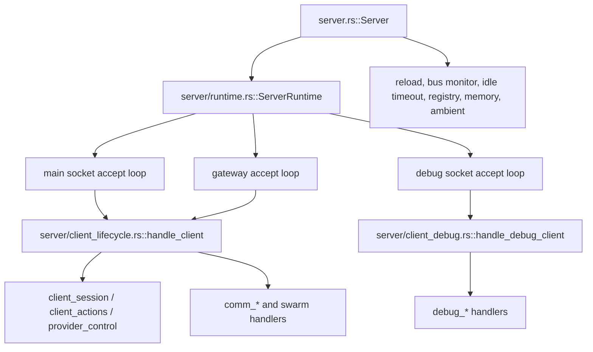
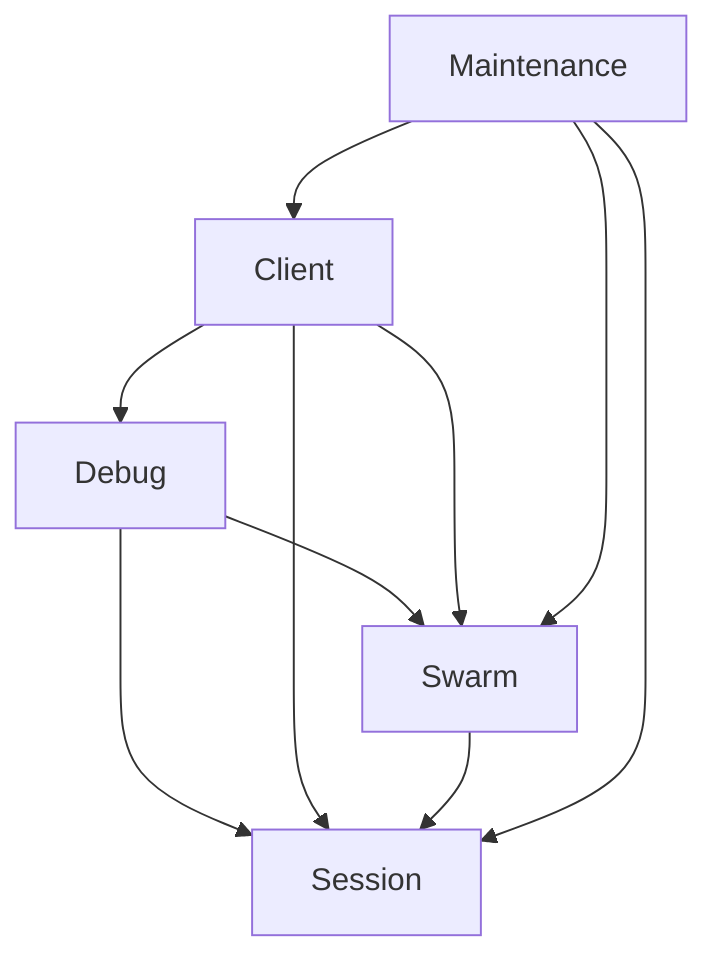

# Server Service Split Plan (Rebuilt for Current Workspace)

Status: Audit-based plan, **re-based 2026-09 against the current crate layout**

> This is a rebuild of `SERVER_SERVICE_SPLIT_PLAN.md` against the code as it
> actually exists today. The original plan targeted `src/server.rs` and
> `src/server/**` inside the monolithic root crate. Since then the server moved
> wholesale into `crates/jcode-app-core/src/server/`. The *diagnosis* remains
> valid, but the *file moves* and *exit criteria* below are re-anchored to the
> current tree so they are actionable rather than aspirational.

Scope: the shared-server implementation in `crates/jcode-app-core/src/server*.rs`
and `crates/jcode-app-core/src/server/**`.

This document proposes an incremental split into five **in-process** services:

- session
- client
- swarm
- debug
- maintenance

The intent is unchanged from the original plan: improve ownership boundaries and
reduce argument fanout **without changing the single-process runtime model**.

---

## Executive Summary

The architecture is still exactly what the original plan described, merely in a
new location:

- `Server` (`crates/jcode-app-core/src/server.rs:687`, ~2.4k LOC) still owns
  nearly all shared state in one struct.
- `ServerRuntime` (`server/runtime.rs:91`) still clones that full state bag,
  field-by-field, into connection handlers.
- `handle_client()` (`server/client_lifecycle.rs:435`) still receives a
  **28-argument** list spanning session, swarm, client, debug, and maintenance
  concerns.
- The main extraction seam is still **not** transport or process boundaries. The
  main seam is **service-owned state + service APIs inside the existing process**.

The safest path is:

1. keep one server process
2. keep current modules and behavior
3. introduce service handle structs around existing state
4. move mutation behind service methods
5. reduce `handle_client()` and `handle_debug_client()` to a few typed contexts

Do **not** start with crates, traits, or IPC splits. The code is not ready for
that yet, and the current pain is ownership fanout, not runtime topology.

> **What changed since the original write-up.** The giant cross-cutting *files*
> the old plan blamed (`src/server.rs` @ ~1731 lines, `client_lifecycle.rs` etc.)
> have mostly been split into a fine-grained `server/**` module tree inside
> `jcode-app-core`. What has **not** changed is the *state ownership*: the
> individual module files are still thin slices over one giant state bag passed
> by hand.

---

## Current Stack Audit

### Top-level runtime shape



### Shared state concentration

`server.rs::Server` still owns one broad state struct. Verified current fields:

| Field | Concern |
|---|---|
| `sessions` | session |
| `session_id`, `is_processing` | session / client |
| `client_count`, `client_connections` | client |
| `swarm_state`, `shared_context`, `swarms_by_id`, `swarm_plans`, `swarm_coordinators` | swarm |
| `file_touch`, `channel_subscriptions[(_by_session)]` | swarm file-touch + channels |
| `client_debug_state`, `client_debug_response_tx`, `debug_jobs` | debug |
| `event_history`, `event_counter`, `swarm_event_tx` | swarm events |
| `ambient_runner`, `mcp_pool` | maintenance / shared |
| `shutdown_signals`, `soft_interrupt_queues` | session lifecycle |
| `await_members_runtime`, `swarm_mutation_runtime` | swarm coordination |

This is a service container in practice, but still one broad state owner.

### Existing positive seams

- `runtime.rs` already isolates accept-loop orchestration from bootstrap.
- `state.rs` already centralizes shared delivery helpers: `SessionControlHandle`,
  `SwarmState`, `SharedContext`, file-touch and channel bookkeeping.
- `swarm.rs` is already a stateful domain service (membership, plans,
  coordination).
- `reload.rs`, `debug_*`, `client_*` are split by command/domain already.
- `pub(super) struct ServerRuntime` (only a small `server` accessor fn) already
  centralizes the state bag clone.

These are good extraction points. The plan below leans on them.

### Module heat map (current)

| File | Lines | Primary concern today | Future service |
|---|---:|---|---|
| `server/client_lifecycle.rs` | ~3660 | client request loop + wide router | client |
| `server/swarm.rs` | ~3200 | swarm state mutation and fanout | swarm |
| `server/comm_control.rs` | ~2600 | swarm control / await-members / debug bridge | swarm + debug |
| `server/client_session.rs` | ~1770 | subscribe, resume, clear, reload | session + client boundary |
| `server/provider_control.rs` | ~1610 | provider lifecycle per session | session |
| `server/client_lifecycle.rs` (tests) | ~1500 | | |
| `server/comm_session` | ~ | spawn/stop session flows | session + swarm boundary |
| `server/debug.rs` | ~980 | debug socket command router | debug |
| `server/reload.rs` | ~826 | reload + graceful shutdown | maintenance |

Interpretation is unchanged: the architecture is **not** blocked on missing
modules. It is blocked on **cross-service state access** and **router width**.

---

## Where Coupling Is Highest

### 1. `ServerRuntime` is a full-state courier

`runtime.rs` clones almost every shared field into the runtime and forwards them
into accept loops. This makes transport code depend on internal service storage
details.

### 2. `handle_client()` is both connection loop and application router

The 28-argument prototype at `client_lifecycle.rs:435`:

```rust
pub(super) async fn handle_client(
    stream: Stream,
    sessions: SessionAgents,
    _global_event_tx: broadcast::Sender<ServerEvent>,
    provider_template: Arc<dyn Provider>,
    _global_is_processing: Arc<RwLock<bool>>,
    global_session_id: Arc<RwLock<String>>,
    client_count: Arc<RwLock<usize>>,
    client_connections: Arc<RwLock<HashMap<String, ClientConnectionInfo>>>,
    swarm_members: Arc<RwLock<HashMap<String, SwarmMember>>>,
    swarms_by_id: Arc<RwLock<HashMap<String, HashSet<String>>>>,
    shared_context: Arc<RwLock<...>>,
    swarm_plans: Arc<RwLock<HashMap<String, VersionedPlan>>>,
    swarm_coordinators: Arc<RwLock<HashMap<String, String>>>,
    file_touch: FileTouchService,
    channel_subscriptions: ChannelSubscriptions,
    channel_subscriptions_by_session: ChannelSubscriptions,
    client_debug_state: Arc<RwLock<ClientDebugState>>,
    client_debug_response_tx: broadcast::Sender<(u64, String)>,
    event_history: Arc<RwLock<VecDeque<SwarmEvent>>>,
    event_counter: Arc<AtomicU64>,
    swarm_event_tx: broadcast::Sender<SwarmEvent>,
    server_name: String,
    server_icon: String,
    mcp_pool: Arc<SharedMcpPool>,
    shutdown_signals: Arc<RwLock<HashMap<String, InterruptSignal>>>,
    soft_interrupt_queues: SessionInterruptQueues,
    await_members_runtime: AwaitMembersRuntime,
    swarm_mutation_runtime: SwarmMutationRuntime,
) -> Result<()> { ... }
```

This is the clearest signal that client, session, swarm, and debug
responsibilities cross in one place. Wide, positional, all `Arc`s.

### 3. Session flows directly mutate swarm state

`client_session.rs` still does session work while directly touching swarm
membership, channel subscription cleanup, plan participant rename/removal, status
updates, event sender registration, and interrupt queue rename/removal.

### 4. Maintenance loops reach into domain maps directly

`server.rs` maintenance tasks (reload, background wakeup/notification, bus
monitor/file-touch, idle timeout, runtime memory logging, registry publishing,
ambient scheduling) still touch shared state directly.

### 5. Debug paths bypass future boundaries

`debug.rs` + `debug_*` inspect/mutate many raw stores directly. Fine now, but
they will block extraction unless debug becomes a consumer of service snapshots.

---

## Proposed Service Split

Still one process, one Tokio runtime. The change is ownership and APIs.

### 1. Session Service

**Owns:** `sessions`, `session_id`, `shutdown_signals`, `soft_interrupt_queues`,
session event sender registration/fanout, session-local agent actions and
provider/session mutation, headless session primitives.

Primary modules: `state.rs` delivery pieces, `client_session.rs` session-only
parts, `client_actions.rs`, `provider_control.rs`, `headless.rs`, parts of
`reload.rs` for graceful-shutdown helpers.

Public API examples: `attach_client`, `resume_session`, `clear_session`,
`spawn_headless_session`, `queue_soft_interrupt`, `fanout_session_event`,
`rename_session`, `shutdown_session`, `session_snapshot`.

Boundary rule: must not directly own swarm membership rules. It exposes
lifecycle events / returns metadata that another layer uses to update swarm state.

### 2. Client Service

**Owns:** socket/debug/gateway transport accept loops, client connection
registry, client count / attachment count, connection-scoped state and request
routing, subscribe/reconnect orchestration across services, client API wrappers.

Primary modules: `runtime.rs`, `socket.rs`, `client_api.rs`, `client_lifecycle.rs`
(connection loop + router only), `client_disconnect_cleanup.rs`, client-facing
parts of `client_state.rs`.

Public API examples: `spawn_accept_loops`, `run_client_connection(stream)`,
`register_connection`, `cleanup_connection`, `connected_clients_snapshot`.

Boundary rule: routes requests, does not own business state for sessions, swarms,
or debug jobs.

### 3. Swarm Service

**Owns:** `swarm_members`, `swarms/plans/coordinators`, `shared_context`,
channel subscriptions and reverse indexes, swarm event history/broadcast, file
touch tracking + reverse indexes, await-members runtime, status/plan/conflict
broadcast.

Primary modules: `swarm.rs`, `client_comm.rs`, `comm_plan.rs`,
`comm_control.rs` (swarm), `comm_session.rs` (coordination portions),
`comm_sync.rs`, `file_touch_service.rs`, `swarm_channels.rs`,
`await_members_state.rs`, `swarm_mutation_state.rs`.

Public API examples: `join_swarm`, `leave_swarm`, `set_member_status`,
`assign_role`, `update_plan`, `subscribe_channel`, `publish_notification`,
`record_file_touch`, `detect_conflicts`, `await_members`, `snapshot_swarm`.

Boundary rule: can request message delivery through the session service but not
reach into raw session maps.

### 4. Debug Service

**Owns:** debug socket request router, client debug bridge state, debug job
registry, testers + debug command execution helpers, server + swarm snapshots for
inspection.

Primary modules: `debug.rs`, `debug_command_exec.rs`, `debug_events.rs`,
`debug_help.rs`, `debug_jobs.rs`, `debug_server_state.rs`,
`debug_session_admin.rs`, `debug_swarm_read.rs`, `debug_swarm_write.rs`,
`debug_testers.rs`, `debug_ambient.rs`.

Public API examples: `run_debug_connection`, `submit_debug_job`,
`server_snapshot`, `swarm_snapshot`, `route_transcript_injection`.

Boundary rule: reads snapshots from other services; mutates only through explicit
service methods. Not a privileged backdoor except where intentionally documented.

### 5. Maintenance Service

**Owns:** reload monitor/reload plumbing, registry publish/cleanup, idle timeout,
runtime memory logging, embedding preload/unload, ambient loop wiring, background
task completion delivery, bus subscription loops.

Primary modules: `reload.rs`, `reload_state.rs`, `server.rs` background-task
delivery, registry / idle / memory pieces, `monitor_bus()` after it is narrowed.

Public API examples: `start_background_loops`, `handle_reload_signal`,
`deliver_background_task_completion`, `publish_registry_metadata`, `run_idle_monitor`,
`run_bus_monitor`.

Boundary rule: orchestrates services, does not own their domain maps.

---

## Recommended Dependency Direction



Rules:

- `Server` becomes bootstrap and wiring only.
- `ServerRuntime` becomes transport runtime only.
- session and swarm are the main domain services.
- debug and maintenance depend on domain services, not the reverse.

## Concrete Extraction Seams (re-anchored)

### Seam A: turn `state.rs` into the session-delivery foundation

`state.rs` already centralizes `SessionAgents` registries, session event fanout,
soft-interrupt queues, and `SessionControlHandle`. Make this the backbone of the
session service rather than generic helpers.

Why safe: logic already centralized, heavily reused by swarm/debug/maintenance.

### Seam B: separate connection routing from business handlers

Split `client_lifecycle.rs` into:

- a `ClientConnection` type (stream handling + per-client state)
- a `ClientRequestRouter` mapping `Request` variants to service calls over
  `SessionService`, `SwarmService`, `DebugService` handles (not raw
  `Arc<RwLock<HashMap<...>>>`).

Why safe: no protocol change, no state-ownership change; mostly signature
narrowing and file movement.

### Seam C: move swarm membership side effects out of session lifecycle code

Subscribe/resume/clear paths should become:

- session service: attach/resume/rename
- swarm service: join/update/leave member
- client service: orchestrate the sequence for a request

This is the most important semantic seam. See
`client_session.rs` side effects today.

### Seam D: make maintenance loops call service APIs only

`monitor_bus()`, reload, idle, background-task wakeup should call
`session_service.queue_soft_interrupt(...)`, `swarm_service.record_file_touch(...)`,
`swarm_service.broadcast_status(...)`, etc., instead of mutating maps directly.

### Seam E: make debug consume snapshots, not storage

Introduce `session_service.snapshot_sessions()`, `client_service.snapshot_connections()`,
`swarm_service.snapshot_state()`, `maintenance_service.snapshot_runtime_health()` so
debug reads pre-shaped data.

---

## Service Handle Structs (the concrete first move)

The first code change is to add thin handles, each wrapping the relevant `Arc`/
`Arc<RwLock<...>>` fields already cloned into `ServerRuntime`:

```rust
// server/services/session.rs
#[derive(Clone)]
pub struct SessionServiceHandle {
    sessions: SessionAgents,
    session_id: Arc<RwLock<String>>,
    shutdown_signals: Arc<RwLock<HashMap<String, InterruptSignal>>>,
    soft_interrupt_queues: SessionInterruptQueues,
    event_tx: broadcast::Sender<ServerEvent>,
    // ...
}

// server/services/client.rs
#[derive(Clone)]
pub struct ClientServiceHandle { a: SessionAgents, client_count: ..., client_connections: ..., ... }

// server/services/swarm.rs
#[derive(Clone)]
pub struct SwarmServiceHandle { swarm_state: SwarmState, shared_context, file_touch, channels, event_history, ... }

// server/services/debug.rs

 // server/services/maintenance.rs
```

These do **not** move logic yet. They wrap the current fields, which stops the
spread of 20+ argument lists immediately and gives values a home.

---

## First Safe Moves

1. **Docs + ownership rules** (this document) so later extractions don't worsen coupling.
2. **Introduce service handle structs** with zero behavior change (wraps current Arc fields).
3. **Change `ServerRuntime::from_server` to build handles once**; store handle in the runtime.
4. **Narrow `handle_client()` / `handle_debug_client()` inputs** to use the handles +
   a small `ClientRequestContext`/`DebugRequestContext`.
5. **Extract swarm membership orchestration from `client_session.rs`** into
   `SwarmService` methods, called by session/client flows.
6. **Move `monitor_bus()` behind the swarm/session API boundary.**

## Moves to avoid early

Until the service-handle layer exists:

- splitting into separate processes
- creating new crates per service
- async traits for every domain call
- changing the on-the-wire protocol
- changing session persistence format
- merging debug + normal sockets as part of the refactor

## Suggested file landing plan

### Phase 1: no behavior change

- add service handle types
- make `Server` hold/construct those handles
- thread handles through `runtime.rs`
- narrow `handle_client` + `handle_debug_client`

### Phase 2: move ownership boundaries

- move session delivery helpers under session service
- move swarm membership/status/channel/plan mutation fully under swarm service
- move maintenance loops to service APIs
- move debug readers to service snapshots

### Phase 3: clean module layout

```text
jcode-app-core/src/server/
  bootstrap.rs            # server.rs bootstrap pieces
  runtime.rs              # accept loops + transport runtime
  services/
    session.rs
    client.rs
    swarm.rs
    debug.rs
    maintenance.rs
  session/                # actions.rs, lifecycle.rs, provider.rs, delivery.rs
  swarm/                  # comm.rs, plan.rs, control.rs, sync.rs, state.rs
  debug/                  # router.rs, jobs.rs, snapshots.rs, testers.rs
  maintenance/            # reload.rs, bus.rs, idle.rs, memory.rs, registry.rs
```

## Decision Record

### Recommended first code extraction

After this document: **introduce service handle structs only** (`services/*.rs`),
the same safe first move the original plan recommended. It narrows dependency
surfaces immediately and creates a place to move methods later.

### Verified-not-done against current tree

Checked 2026-09-07 against `crates/jcode-app-core/src/`:

- No `services/` module, no `*ServiceHandle` types → Phase 2 move not started.
  **Now updated:** Slices 1 + 2 landed. Slice 1 added the `server/services/*.rs`
  module with the five `*ServiceHandle` structs + `from_server`; Slice 2 wired
  `ServerRuntime` to hold and route through them. `handle_client`/`handle_debug_client`
  narrowing (Slice 3) is landed too: both now take the service handles and
  destructure them back into the body's flat locals. The remaining
  ownership-move slices (swarm-membership extraction, `monitor_bus` to service
  APIs, debug snapshots) are still pending.
- `ServerRuntime` (`runtime.rs`) now holds and routes through the service
  handles instead of a flat field-by-field clone.
- `handle_client()`/`handle_debug_client` now take the service handles (plus
  their few non-handle params) instead of a 28-argument positional list.
- Session lifecycle (`client_session.rs`) still mutates swarm membership directly.
- Maintenance (`server.rs`) still reaches into raw maps; `monitor_bus` unchanged.
- Debug still reads raw maps.

What HAS landed: the breadth-level file split (many focused modules), `runtime.rs`
already isolates accept loops, `state.rs` centralizes delivery types and
`SwarmState`, `swarm.rs` is already a stateful domain service. The remaining work
is the service-handle/ownership boundary, which is untouched.

---

## Recommended first slice (the highest-leverage, lowest-risk landing)

> **Slice 1 (landed):** `server/services/*.rs` handle structs only, no behavior
> change.

This is the single highest-value move from the plan that unblocks everything else
without risking the runtime model. It is deliberately a **slice**, not a PR:

- **Slice 1 — additive handle structs.** A new `server/services/` module holds
  the five `*ServiceHandle` structs and their `from_server(&Server)` constructors.
  It is a zero-behavior grouping of the existing state bag; nothing else changes.
  This lands cleanly by itself and gives the future service methods a home.
  *(landed)*
- **Slice 2 — wire `ServerRuntime`.** Construct and hold the handles in
  `ServerRuntime::from_server`, then route the `handle_client` /
  `handle_debug_client` call sites through them. Merging a duplicate
  flat-field store is intentionally avoided so nothing is double-homed.
  *(landed)*
- **Slice 3 — narrow the handler signatures.** `handle_client` and
  `handle_debug_client` now take the service handles (plus their few
  non-handle params) instead of the 28-arg positional list, and destructure
  them back into the body's existing flat locals — preserving the bodies
  with no behavior change. *(landed)*
- **Slice 4+ — ownership moves.** Swarm-membership extraction out of
  `client_session.rs`, `monitor_bus` to service APIs, and debug snapshot
  readers. Each is mechanical now that the handles exist.

Each slice is independently reviewable and behavior-preserving; none is gated on
the rest.