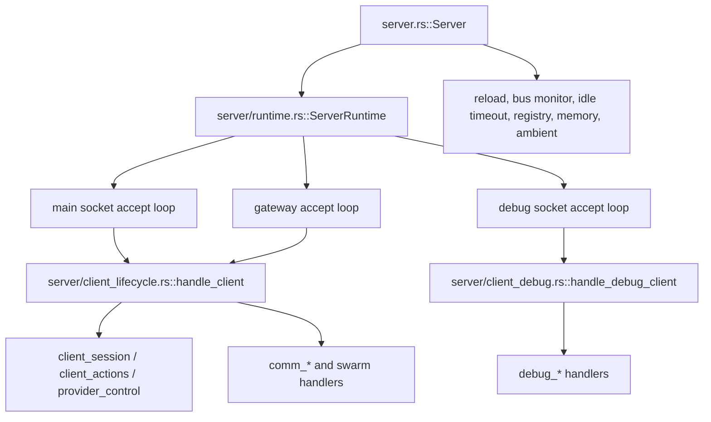
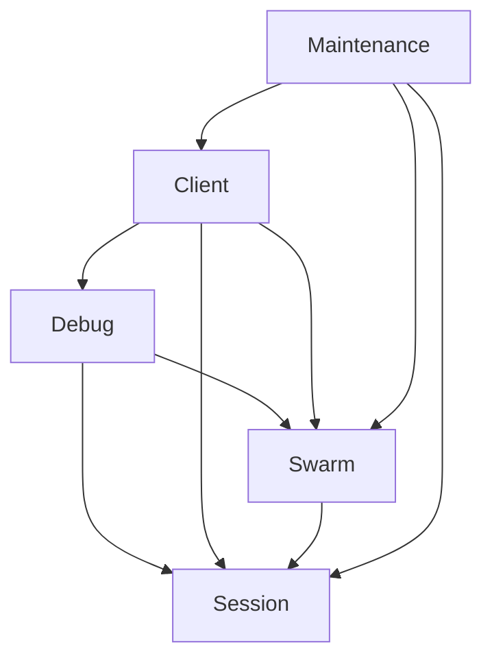

# Server Service Split Plan (Rebuilt for Current Workspace)

Status: Audit-based plan, **re-based 2026-09 against the current crate layout**

> This is a rebuild of `SERVER_SERVICE_SPLIT_PLAN.md` against the code as it
> actually exists today. The original plan targeted `src/server.rs` and
> `src/server/**` inside the monolithic root crate. Since then the server moved
> wholesale into `crates/jcode-app-core/src/server/`. The *diagnosis* remains
> valid, but the *file moves* and *exit criteria* below are re-anchored to the
> current tree so they are actionable rather than aspirational.

Scope: the shared-server implementation in `crates/jcode-app-core/src/server*.rs`
and `crates/jcode-app-core/src/server/**`.

This document proposes an incremental split into five **in-process** services:

- session
- client
- swarm
- debug
- maintenance

The intent is unchanged from the original plan: improve ownership boundaries and
reduce argument fanout **without changing the single-process runtime model**.

---

## Executive Summary

> **Landing status (2026-09):** Slices 1-3 are landed (service-handle structs,
> `ServerRuntime` wiring, and handler-signature narrowing). The session-service
> consolidation is also complete: all six modules that called
> `queue_soft_interrupt_for_session` directly (`jade_relay`,
> `background_tasks`, `client_actions`, `comm_plan`, `comm_control`,
> `client_comm_message`) now route through `SessionServiceHandle::
> queue_soft_interrupt`. This summary describes the problems the split set out
> to solve and the current state.

The architecture was a single broad state owner, now incrementally moved onto
service handles:

- `Server` (`crates/jcode-app-core/src/server.rs`) owns nearly all shared state
  in one struct (still ~2.4k LOC).
- `ServerRuntime` (`server/runtime.rs`) previously cloned that full state bag
  field-by-field; it now holds the five service handles (Slice 2).
- `handle_client()`/`handle_debug_client` previously received 28-argument lists;
  they now take the service handles (Slice 3).
- The main extraction seam is **service-owned state + service APIs inside the
  existing process** (in progress via Slice 4+).

The safest path:

1. keep one server process
2. keep current modules and behavior
3. introduce service handle structs around existing state — *landed*
4. move mutation behind service methods — *Slice 4+*
5. reduce `handle_client()` and `handle_debug_client()` to a few typed contexts — *landed (Slice 3)*

Do **not** start with crates, traits, or IPC splits. The code is not ready for
that yet, and the current pain is ownership fanout, not runtime topology.

> **What changed since the original write-up.** The giant cross-cutting *files*
> the old plan blamed (`src/server.rs` @ ~1731 lines, `client_lifecycle.rs` etc.)
> have mostly been split into a fine-grained `server/**` module tree inside
> `jcode-app-core`. What has **not** changed is the *state ownership*: the
> individual module files are still thin slices over one giant state bag passed
> by hand.

---

## Current Stack Audit

### Top-level runtime shape



### Shared state concentration

`server.rs::Server` still owns one broad state struct. Verified current fields:

| Field | Concern |
|---|---|
| `sessions` | session |
| `session_id`, `is_processing` | session / client |
| `client_count`, `client_connections` | client |
| `swarm_state`, `shared_context`, `swarms_by_id`, `swarm_plans`, `swarm_coordinators` | swarm |
| `file_touch`, `channel_subscriptions[(_by_session)]` | swarm file-touch + channels |
| `client_debug_state`, `client_debug_response_tx`, `debug_jobs` | debug |
| `event_history`, `event_counter`, `swarm_event_tx` | swarm events |
| `ambient_runner`, `mcp_pool` | maintenance / shared |
| `shutdown_signals`, `soft_interrupt_queues` | session lifecycle |
| `await_members_runtime`, `swarm_mutation_runtime` | swarm coordination |

This is a service container in practice, but still one broad state owner.

### Existing positive seams

- `runtime.rs` already isolates accept-loop orchestration from bootstrap.
- `state.rs` already centralizes shared delivery helpers: `SessionControlHandle`,
  `SwarmState`, `SharedContext`, file-touch and channel bookkeeping.
- `swarm.rs` is already a stateful domain service (membership, plans,
  coordination).
- `reload.rs`, `debug_*`, `client_*` are split by command/domain already.
- `pub(super) struct ServerRuntime` (only a small `server` accessor fn) already
  centralizes the state bag clone.

These are good extraction points. The plan below leans on them.

### Module heat map (current)

| File | Lines | Primary concern today | Future service |
|---|---:|---|---|
| `server/client_lifecycle.rs` | ~3660 | client request loop + wide router | client |
| `server/swarm.rs` | ~3200 | swarm state mutation and fanout | swarm |
| `server/comm_control.rs` | ~2600 | swarm control / await-members / debug bridge | swarm + debug |
| `server/client_session.rs` | ~1770 | subscribe, resume, clear, reload | session + client boundary |
| `server/provider_control.rs` | ~1610 | provider lifecycle per session | session |
| `server/client_lifecycle.rs` (tests) | ~1500 | | |
| `server/comm_session` | ~ | spawn/stop session flows | session + swarm boundary |
| `server/debug.rs` | ~980 | debug socket command router | debug |
| `server/reload.rs` | ~826 | reload + graceful shutdown | maintenance |

Interpretation is unchanged: the architecture is **not** blocked on missing
modules. It is blocked on **cross-service state access** and **router width**.

---

## Where Coupling Is Highest

### 1. `ServerRuntime` is a full-state courier

`runtime.rs` clones almost every shared field into the runtime and forwards them
into accept loops. This makes transport code depend on internal service storage
details.

### 2. `handle_client()` was both connection loop and application router

> **Historical (pre-refactor).** This section documents the original coupling the
> split resolves. Slice 3 replaced this 28-argument prototype with the service
> handles (see "Recommended first slice"), so the signature below no longer
> reflects `client_lifecycle.rs:435`.

The 28-argument prototype that previously lived at `client_lifecycle.rs:435`:

```rust
pub(super) async fn handle_client(
    stream: Stream,
    sessions: SessionAgents,
    _global_event_tx: broadcast::Sender<ServerEvent>,
    provider_template: Arc<dyn Provider>,
    _global_is_processing: Arc<RwLock<bool>>,
    global_session_id: Arc<RwLock<String>>,
    client_count: Arc<RwLock<usize>>,
    client_connections: Arc<RwLock<HashMap<String, ClientConnectionInfo>>>,
    swarm_members: Arc<RwLock<HashMap<String, SwarmMember>>>,
    swarms_by_id: Arc<RwLock<HashMap<String, HashSet<String>>>>,
    shared_context: Arc<RwLock<...>>,
    swarm_plans: Arc<RwLock<HashMap<String, VersionedPlan>>>,
    swarm_coordinators: Arc<RwLock<HashMap<String, String>>>,
    file_touch: FileTouchService,
    channel_subscriptions: ChannelSubscriptions,
    channel_subscriptions_by_session: ChannelSubscriptions,
    client_debug_state: Arc<RwLock<ClientDebugState>>,
    client_debug_response_tx: broadcast::Sender<(u64, String)>,
    event_history: Arc<RwLock<VecDeque<SwarmEvent>>>,
    event_counter: Arc<AtomicU64>,
    swarm_event_tx: broadcast::Sender<SwarmEvent>,
    server_name: String,
    server_icon: String,
    mcp_pool: Arc<SharedMcpPool>,
    shutdown_signals: Arc<RwLock<HashMap<String, InterruptSignal>>>,
    soft_interrupt_queues: SessionInterruptQueues,
    await_members_runtime: AwaitMembersRuntime,
    swarm_mutation_runtime: SwarmMutationRuntime,
) -> Result<()> { ... }
```

This is the clearest signal that client, session, swarm, and debug
responsibilities cross in one place. Wide, positional, all `Arc`s.

### 3. Session flows directly mutate swarm state

`client_session.rs` still does session work while directly touching swarm
membership, channel subscription cleanup, plan participant rename/removal, status
updates, event sender registration, and interrupt queue rename/removal.

### 4. Maintenance loops reach into domain maps directly

`server.rs` maintenance tasks (reload, background wakeup/notification, bus
monitor/file-touch, idle timeout, runtime memory logging, registry publishing,
ambient scheduling) still touch shared state directly.

### 5. Debug paths bypass future boundaries

`debug.rs` + `debug_*` inspect/mutate many raw stores directly. Fine now, but
they will block extraction unless debug becomes a consumer of service snapshots.

---

## Proposed Service Split

Still one process, one Tokio runtime. The change is ownership and APIs.

### 1. Session Service

**Owns:** `sessions`, `session_id`, `shutdown_signals`, `soft_interrupt_queues`,
session event sender registration/fanout, session-local agent actions and
provider/session mutation, headless session primitives.

Primary modules: `state.rs` delivery pieces, `client_session.rs` session-only
parts, `client_actions.rs`, `provider_control.rs`, `headless.rs`, parts of
`reload.rs` for graceful-shutdown helpers.

Public API examples: `attach_client`, `resume_session`, `clear_session`,
`spawn_headless_session`, `queue_soft_interrupt`, `fanout_session_event`,
`rename_session`, `shutdown_session`, `session_snapshot`.

Boundary rule: must not directly own swarm membership rules. It exposes
lifecycle events / returns metadata that another layer uses to update swarm state.

### 2. Client Service

**Owns:** socket/debug/gateway transport accept loops, client connection
registry, client count / attachment count, connection-scoped state and request
routing, subscribe/reconnect orchestration across services, client API wrappers.

Primary modules: `runtime.rs`, `socket.rs`, `client_api.rs`, `client_lifecycle.rs`
(connection loop + router only), `client_disconnect_cleanup.rs`, client-facing
parts of `client_state.rs`.

Public API examples: `spawn_accept_loops`, `run_client_connection(stream)`,
`register_connection`, `cleanup_connection`, `connected_clients_snapshot`.

Boundary rule: routes requests, does not own business state for sessions, swarms,
or debug jobs.

### 3. Swarm Service

**Owns:** `swarm_members`, `swarms/plans/coordinators`, `shared_context`,
channel subscriptions and reverse indexes, swarm event history/broadcast, file
touch tracking + reverse indexes, await-members runtime, status/plan/conflict
broadcast.

Primary modules: `swarm.rs`, `client_comm.rs`, `comm_plan.rs`,
`comm_control.rs` (swarm), `comm_session.rs` (coordination portions),
`comm_sync.rs`, `file_touch_service.rs`, `swarm_channels.rs`,
`await_members_state.rs`, `swarm_mutation_state.rs`.

Public API examples: `join_swarm`, `leave_swarm`, `set_member_status`,
`assign_role`, `update_plan`, `subscribe_channel`, `publish_notification`,
`record_file_touch`, `detect_conflicts`, `await_members`, `snapshot_swarm`.

Boundary rule: can request message delivery through the session service but not
reach into raw session maps.

### 4. Debug Service

**Owns:** debug socket request router, client debug bridge state, debug job
registry, testers + debug command execution helpers, server + swarm snapshots for
inspection.

Primary modules: `debug.rs`, `debug_command_exec.rs`, `debug_events.rs`,
`debug_help.rs`, `debug_jobs.rs`, `debug_server_state.rs`,
`debug_session_admin.rs`, `debug_swarm_read.rs`, `debug_swarm_write.rs`,
`debug_testers.rs`, `debug_ambient.rs`.

Public API examples: `run_debug_connection`, `submit_debug_job`,
`server_snapshot`, `swarm_snapshot`, `route_transcript_injection`.

Boundary rule: reads snapshots from other services; mutates only through explicit
service methods. Not a privileged backdoor except where intentionally documented.

### 5. Maintenance Service

**Owns:** reload monitor/reload plumbing, registry publish/cleanup, idle timeout,
runtime memory logging, embedding preload/unload, ambient loop wiring, background
task completion delivery, bus subscription loops.

Primary modules: `reload.rs`, `reload_state.rs`, `server.rs` background-task
delivery, registry / idle / memory pieces, `monitor_bus()` after it is narrowed.

Public API examples: `start_background_loops`, `handle_reload_signal`,
`deliver_background_task_completion`, `publish_registry_metadata`, `run_idle_monitor`,
`run_bus_monitor`.

Boundary rule: orchestrates services, does not own their domain maps.

---

## Recommended Dependency Direction



Rules:

- `Server` becomes bootstrap and wiring only.
- `ServerRuntime` becomes transport runtime only.
- session and swarm are the main domain services.
- debug and maintenance depend on domain services, not the reverse.

## Concrete Extraction Seams (re-anchored)

### Seam A: turn `state.rs` into the session-delivery foundation

`state.rs` already centralizes `SessionAgents` registries, session event fanout,
soft-interrupt queues, and `SessionControlHandle`. Make this the backbone of the
session service rather than generic helpers.

Why safe: logic already centralized, heavily reused by swarm/debug/maintenance.

### Seam B: separate connection routing from business handlers

Split `client_lifecycle.rs` into:

- a `ClientConnection` type (stream handling + per-client state)
- a `ClientRequestRouter` mapping `Request` variants to service calls over
  `SessionService`, `SwarmService`, `DebugService` handles (not raw
  `Arc<RwLock<HashMap<...>>>`).

Why safe: no protocol change, no state-ownership change; mostly signature
narrowing and file movement.

### Seam C: move swarm membership side effects out of session lifecycle code

Subscribe/resume/clear paths should become:

- session service: attach/resume/rename
- swarm service: join/update/leave member
- client service: orchestrate the sequence for a request

This is the most important semantic seam. See
`client_session.rs` side effects today.

### Seam D: make maintenance loops call service APIs only

`monitor_bus()`, reload, idle, background-task wakeup should call
`session_service.queue_soft_interrupt(...)`, `swarm_service.record_file_touch(...)`,
`swarm_service.broadcast_status(...)`, etc., instead of mutating maps directly.

### Seam E: make debug consume snapshots, not storage

Introduce `session_service.snapshot_sessions()`, `client_service.snapshot_connections()`,
`swarm_service.snapshot_state()`, `maintenance_service.snapshot_runtime_health()` so
debug reads pre-shaped data.

---

## Service Handle Structs (the concrete first move)

The first code change is to add thin handles, each wrapping the relevant `Arc`/
`Arc<RwLock<...>>` fields already cloned into `ServerRuntime`:

```rust
// server/services/session.rs
#[derive(Clone)]
pub struct SessionServiceHandle {
    sessions: SessionAgents,
    session_id: Arc<RwLock<String>>,
    shutdown_signals: Arc<RwLock<HashMap<String, InterruptSignal>>>,
    soft_interrupt_queues: SessionInterruptQueues,
    event_tx: broadcast::Sender<ServerEvent>,
    // ...
}

// server/services/client.rs
#[derive(Clone)]
pub struct ClientServiceHandle { a: SessionAgents, client_count: ..., client_connections: ..., ... }

// server/services/swarm.rs
#[derive(Clone)]
pub struct SwarmServiceHandle { swarm_state: SwarmState, shared_context, file_touch, channels, event_history, ... }

// server/services/debug.rs

 // server/services/maintenance.rs
```

These do **not** move logic yet. They wrap the current fields, which stops the
spread of 20+ argument lists immediately and gives values a home.

---

## First Safe Moves

1. **Docs + ownership rules** (this document) so later extractions don't worsen coupling.
2. **Introduce service handle structs** with zero behavior change (wraps current Arc fields).
3. **Change `ServerRuntime::from_server` to build handles once**; store handle in the runtime.
4. **Narrow `handle_client()` / `handle_debug_client()` inputs** to use the handles +
   a small `ClientRequestContext`/`DebugRequestContext`.
5. **Extract swarm membership orchestration from `client_session.rs`** into
   `SwarmService` methods, called by session/client flows.
6. **Move `monitor_bus()` behind the swarm/session API boundary.**

## Moves to avoid early

Until the service-handle layer exists:

- splitting into separate processes
- creating new crates per service
- async traits for every domain call
- changing the on-the-wire protocol
- changing session persistence format
- merging debug + normal sockets as part of the refactor

## Suggested file landing plan

### Phase 1: no behavior change

- add service handle types
- make `Server` hold/construct those handles
- thread handles through `runtime.rs`
- narrow `handle_client` + `handle_debug_client`

### Phase 2: move ownership boundaries

- move session delivery helpers under session service
- move swarm membership/status/channel/plan mutation fully under swarm service
- move maintenance loops to service APIs
- move debug readers to service snapshots

### Phase 3: clean module layout

```text
jcode-app-core/src/server/
  bootstrap.rs            # server.rs bootstrap pieces
  runtime.rs              # accept loops + transport runtime
  services/
    session.rs
    client.rs
    swarm.rs
    debug.rs
    maintenance.rs
  session/                # actions.rs, lifecycle.rs, provider.rs, delivery.rs
  swarm/                  # comm.rs, plan.rs, control.rs, sync.rs, state.rs
  debug/                  # router.rs, jobs.rs, snapshots.rs, testers.rs
  maintenance/            # reload.rs, bus.rs, idle.rs, memory.rs, registry.rs
```

## Decision Record

### Recommended first code extraction

After this document: **introduce service handle structs only** (`services/*.rs`),
the same safe first move the original plan recommended. It narrows dependency
surfaces immediately and creates a place to move methods later.

### Verified-not-done against current tree

Checked 2026-09-07 against `crates/jcode-app-core/src/`:

- Slices 1 + 2 landed. Slice 1 added the `server/services/*.rs`
  module with the five `*ServiceHandle` structs + `from_server`; Slice 2 wired
  `ServerRuntime` to hold and route through them. `handle_client`/`handle_debug_client`
  narrowing (Slice 3) is landed too: both now take the service handles and
  destructure them back into the body's flat locals. The remaining
  ownership-move slices (swarm-membership extraction, `monitor_bus` to service
  APIs, debug snapshots) are still pending.
- `ServerRuntime` (`runtime.rs`) now holds and routes through the service
  handles instead of a flat field-by-field clone.
- `handle_client()`/`handle_debug_client` now take the service handles (plus
  their few non-handle params) instead of a 28-argument positional list.
- Session lifecycle (`client_session.rs`) still mutates swarm membership directly.
- Maintenance (`server.rs`) still reaches into raw maps; `monitor_bus` unchanged.
- Debug still reads raw maps.

What HAS landed: the breadth-level file split (many focused modules), `runtime.rs`
already isolates accept loops, `state.rs` centralizes delivery types and
`SwarmState`, `swarm.rs` is already a stateful domain service. Slices 1-3 added
the service-handle structs, wired `ServerRuntime`, and narrowed the handler
signatures. Slice 4 (swarm-membership extraction) is underway: the three session
lifecycle functions (`handle_subscribe`, `handle_clear_session`,
`handle_resume_session`) now take the `SwarmServiceHandle` instead of a flat
swarm-domain argument bag, and the membership operations have moved onto
`SwarmServiceHandle` methods (`member_should_mark_ready`,
`rename_member_session`, `ensure_member` for join-swarm registration,
`take_session_membership` for `/clear` teardown, `set_member_status` for status
updates, `remove_plan_participant` / `rename_plan_participant` for plan
participant edits, and `remove_session_from_swarm` / `record_swarm_event` /
`remove_session_channel_subscriptions` for teardown). `handle_comm_stop` and
`cleanup_client_connection` now take `&SwarmServiceHandle` and route their
depart teardown through the handle instead of the raw swarm maps. On
`monitor_bus`, the dead
`_swarm_plans`/`_swarm_coordinators`/`_shared_context` arguments were removed
(full simplification to service APIs is a separate maintenance-service move).
Debug now routes all of its swarm-state interaction through the
`SwarmServiceHandle`: `debug_swarm_read`, `debug_server_state` (and its two
memory helpers), and `debug_swarm_write` (via `DebugSwarmWriteContext`). Seam E
(debug consumes swarm state through the service, not raw maps) is complete.
`monitor_bus` (Seam D) now takes the `SwarmServiceHandle` and
`SessionServiceHandle` for its swarm- and session-domain state. The session
lifecycle moves status updates behind `SwarmServiceHandle::set_member_status`,
and the session service gains its first method (`SessionServiceHandle::
queue_soft_interrupt`, Seam A start). The session-service consolidation is now
applied end-to-end to one complete module: `jade_relay` single-homes all of its
`queue_soft_interrupt_for_session` call sites through
`SessionServiceHandle::queue_soft_interrupt`, threading the handle through both
`RelayClient` and `RelayLauncherClient`
(`spawn_if_configured` -> `run`/`run_from_after` -> `handle_prompt`/
`handle_cancel`/`handle_launch` -> `deliver_to_session`/`spawn_session_listener`).

The session-service consolidation is now complete across all six modules that
previously called `queue_soft_interrupt_for_session` directly: `jade_relay`,
`background_tasks` (`dispatch_background_task_completion`, `_stalled`, and
`dispatch_swarm_await_completion`), `client_actions`
(`handle_notify_session`, via `NotifySessionContext`), `comm_plan`
(`handle_comm_propose_plan`/`approve_plan`/`reject_plan`), `comm_control`
(`handle_comm_assign_task`/`assign_next`/`task_control`), and
`client_comm_message` (`handle_comm_message`). Each now takes
`&SessionServiceHandle` (or holds it in its router context) instead of the
`sessions`/`soft_interrupt_queues` flat pair, binds the `sessions` map from the
handle where live-turn reads and spawns still need it, and routes every
`queue_soft_interrupt_for_session` call through
`SessionServiceHandle::queue_soft_interrupt`. `LightweightControlContext` gains
a `session` field so both the normal and lightweight request routers pass the
handle through to the comm handlers. Test fixtures in `comm_control_tests.rs`,
`client_comm_tests.rs`, and `server/tests.rs` build a minimal session handle via
a shared helper. This was purely mechanical, behavior-preserving churn, done
module-by-module with tests green after each.

The only remaining `queue_soft_interrupt_for_session` references in production
are the state.rs definition and its module-root re-export; the session service
handle's `queue_soft_interrupt` is now the single call path. Reducing the few
remaining swarm-domain free-function call sites (e.g. `update_member_status`)
and the router clone-then-destructure refactor in `handle_client` remain
separate decisions (cosmetic, high-churn).

---

## Recommended first slice (the highest-leverage, lowest-risk landing)

> **Slice 1 (landed):** `server/services/*.rs` handle structs only, no behavior
> change.

This is the single highest-value move from the plan that unblocks everything else
without risking the runtime model. It is deliberately a **slice**, not a PR:

- **Slice 1 — additive handle structs.** A new `server/services/` module holds
  the five `*ServiceHandle` structs and their `from_server(&Server)` constructors.
  It is a zero-behavior grouping of the existing state bag; nothing else changes.
  This lands cleanly by itself and gives the future service methods a home.
  *(landed)*
- **Slice 2 — wire `ServerRuntime`.** Construct and hold the handles in
  `ServerRuntime::from_server`, then route the `handle_client` /
  `handle_debug_client` call sites through them. Merging a duplicate
  flat-field store is intentionally avoided so nothing is double-homed.
  *(landed)*
- **Slice 3 — narrow the handler signatures.** `handle_client` and
  `handle_debug_client` now take the service handles (plus their few
  non-handle params) instead of the 28-arg positional list, and destructure
  them back into the body's existing flat locals — preserving the bodies
  with no behavior change. *(landed)*
- **Slice 4+ — ownership moves.** Swarm-membership extraction out of
  `client_session.rs`, `monitor_bus` to service APIs, and debug snapshot
  readers. Each is mechanical now that the handles exist. *(partially landed:
  `handle_subscribe`/`handle_clear_session`/`handle_resume_session` now take the
  `SwarmServiceHandle`, and `member_should_mark_ready` / `rename_member_session`
  / `ensure_member` / `take_session_membership` live on the handle)*

Each slice is independently reviewable and behavior-preserving; none is gated on
the rest.
---

### Design decision on Slice 4 execution (landed 2026-09)

Two credible ways to route `client_session.rs` through the swarm service were
considered:

- **A. Thread `&SwarmServiceHandle` in and bind flat locals in the body**
  (chosen). The session function takes one `&SwarmServiceHandle`; the body binds
  `let swarm_members = &swarm.swarm_state.members;` etc. and keeps every in-body
  reference. This removed ~29 flat swarm params across the three functions for
  near-zero churn and a byte-identical body.
- **B. Extract every remaining in-body swarm mutation into handle methods all at
  once** (rejected). Files like `handle_subscribe` and `handle_resume_session`
  also orchestrate coordinator handoff, plan-participant rename, persistence,
  channel cleanup, and status broadcasts that are interleaved with session
  logic. Hoisting all of that behind methods in one slice would be a much larger,
  single, hard-to-review diff with higher risk of a subtle ordering/borrow change.

A won because it delivers the plan's immediate goal (stop the flat argument
bag, give the swarm state a typed home) at low risk, in reviewable commits, and
it leaves the door open to keep pulling specific operations onto the handle (as
was then done for `member_should_mark_ready`, `rename_member_session`, and
`ensure_member`). Its cost is that some body code still reaches the maps through
handle-bound locals rather than calling a dedicated handle method; the residual
direct access is concentrated in the few orchestration-heavy subscribe/resume
paths, which remain candidates for a later, narrowly-scoped extraction.

---

### Further client-request and bus-dispatch routing landed (2026-09)

Two more slices landed in the same ownership direction, both thin wrapper +
call-site migrations with tests green:

- **`AgentTaskContext` collapsed onto the swarm handle.** `handle_agent_task`
  (`client_actions.rs`) previously carried six flat swarm fields on its
  context and called the free `swarm::update_member_status` with each. Its
  `AgentTaskContext` now holds the `SwarmServiceHandle` (plus the client event
  sender), and the `running`/`completed`/`failed` member-status updates route
  through the existing `swarm.set_member_status`. This narrows the client
  request router's flat-field fanout (Seam B) and drops the direct
  `update_member_status` use in `client_actions.rs`.
- **Five `monitor_bus` swarm dispatchers route through the swarm handle.** The
  `dispatch_swarm_output_tail` / `_todo_progress` / `_tool_activity` /
  `_runtime_status` / `_batch_progress` functions (all called only from
  `monitor_bus`, no test call sites) each carried the raw
  `swarm_members`/`swarms_by_id` pair and called the free
  `swarm::broadcast_swarm_status`. They now take `&SwarmServiceHandle` and
  route the rebroadcast through a new `swarm.broadcast_swarm_status(swarm_id)`
  method (Seam D progress). Each body binds the membership map from the handle
  as a local so the mutation logic is byte-identical.

- **`dispatch_background_task_completion` / `_stalled` /
  `dispatch_swarm_await_completion` route through the swarm handle.** The three
  `monitor_bus` task/await delivery functions each carried the raw five-field
  swarm bag (`swarm_members` / `swarms_by_id` / `event_history` /
  `event_counter` / `swarm_event_tx`). They now take `&SwarmServiceHandle`
  (plus `&SessionServiceHandle`) and bind the flat maps as body locals, so
  `monitor_bus` hands every swarm-domain bus event to the dispatchers via the
  typed handle instead of five positional arcs. This also dropped the now-unfulfilled
  `#[expect(clippy::too_many_arguments)]` attributes on all three, clearing those
  three lint warnings. Tests gained a `test_swarm_service_handle` helper for the
  three `dispatch_background_task_completion` call sites.

### client_session, handle_set_feature, and live-turn status routing landed (2026-09)

Four more slices landed in the same ownership direction, all thin wrapper +
call-site migrations with tests green after each.

- **`handle_subscribe` swarm-status rebroadcast routes through the handle.**
  The two `broadcast_swarm_status` calls in `client_session.rs::handle_subscribe`
  (swarm-id rename / membership-change rebroadcast) now go through the existing
  `swarm.broadcast_swarm_status(&id)`, dropping the free-function import.
- **`client_session.rs` teardown/channel cleanup collapses onto the handle.**
  `handle_subscribe` and `handle_resume_session` now call
  `swarm.remove_session_channel_subscriptions`; the private
  `cleanup_detached_source_session_if_unused` helper collapsed its flat 8-arg
  swarm bag (`members` + `swarms_by_id` + `coordinators` + `plans` +
  `channel_subscriptions` x2) onto `&SwarmServiceHandle`, routing
  `remove_session_channel_subscriptions` and `remove_session_from_swarm`
  through the handle. Drops the now-unused `ChannelSubscriptions` type alias,
  the `VersionedPlan` import, four flat swarm params on the helper, and its
  `too_many_arguments` allow.
- **`handle_set_feature` swarm toggle routes through the handle.** The
  `client_actions.rs` Swarm toggle (the only remaining direct free-function
  `update_member_status`-adjacent swarm mutator in that file) now takes
  `&SwarmServiceHandle` instead of a flat 7-arg bag, binding the
  members/swarms/coordinators/plans maps as body locals and routing
  `remove_session_from_swarm`, `remove_session_channel_subscriptions`, and
  `broadcast_swarm_status` through handle methods. The `client_lifecycle`
  router passes `&swarm_service_handle`; the toggle test builds a minimal
  handle. Drops the `ChannelSubscriptions` alias, the 
  `remove_session_*`/`broadcast_swarm_status` imports, and the fulfilled
  `too_many_arguments` attr.
- **Live-turn member status routes through the handle.** The flat 5-field
  `SwarmStatusRefs` wrapper in `client_lifecycle.rs` now carries
  `&SwarmServiceHandle`, and the three live/cancel helpers
  (`record_processing_completion`, `start_processing_message`,
  `cancel_processing_message`) route their member-status updates through three
  new handle methods: `set_member_status`, `set_member_status_with_report`, and
  `set_member_status_with_report_tldr`. All six `SwarmStatusRefs` construction
  sites in `handle_client` pass `&swarm_service_handle`, and the `CommReport`
  tldr path routes through the handle too (making all three variants used).
  Drops the now-unused `update_member_status*` imports, `HashSet`,
  `broadcast`, and `SwarmEvent` in `client_lifecycle.rs`. Tests build the
  handle via a new `test_swarm_status_handle` helper.
- **`server.rs` headless-recovery member-status routes through the handle
  (Seam D).** `recover_headless_sessions_on_startup` now builds
  `SwarmServiceHandle::from_server(self)` once and routes all four
  `update_member_status` maintenance-path calls (the `failed` load-failure,
  the `ready` skipped-recovery, and inside the spawned continuation task the
  `running` resume and the `ready`/`failed` completion) through
  `swarm.set_member_status`, cloning the handle into the `tokio::spawn`
  closure. Drops the now-unused `recover_swarms_by_id` and three
  `recover_event_*` clones from the closure (only `recover_swarm_members` and
  `recover_swarm_state` remain for the persistence read). The
  `update_member_status*` imports stay because submodules re-export them via
  `super::`; only the maintenance path's free call sites are gone.
- **`debug_session_admin.rs` session-admin commands route through the handle.**
  `maybe_handle_session_admin_command` collapsed its flat 8-arg swarm bag
  (`members` + `swarms_by_id` + `coordinators` + `plans` + `event_history` +
  `event_counter` + `event_tx`) onto `&SwarmServiceHandle`, binding the maps as
  body locals and routing the `destroy_session:` teardown's two
  `record_swarm_event` calls and its `broadcast_swarm_status` through handle
  methods. Its sole caller `handle_debug_client` passes its existing
  `swarm_service_handle` and drops the now-unused `swarms_by_id` / `swarm_plans`
  / `swarm_coordinators` / `event_counter` locals plus the too_many_arguments
  attr (now 7 params). `create_headless_session` keeps its own flat bag
  (separate cascade).

- **Role assignment routes through the handle.** `handle_comm_assign_role`
  collapsed its flat 7-arg swarm bag (`members` + `swarms_by_id` +
  `coordinators` + `plans` + `event_history` + `event_counter` + `event_tx`)
  onto `&SwarmServiceHandle`, binding the maps as body locals and routing
  `persist_swarm_state_for`, `broadcast_swarm_status`, and `record_swarm_event`
  through handle methods. Both routers (`client_lifecycle.rs::handle_client`
  and `client_lightweight_control.rs::handle_lightweight_control_request`) pass
  `&swarm_service_handle` / `swarm`. Drops the now-unused
  `broadcast_swarm_status` import. Restored the
  `clippy::too_many_arguments` attributes that the prior slices had dropped:
  the original `#[expect]` on `handle_set_feature` (`client_actions.rs`) and
  the original `#[allow]` on `cleanup_detached_source_session_if_unused`
  (`client_session.rs`), both still over the 7-arg threshold.

The remaining free-function call sites for `update_member_status` /
`broadcast_swarm_status` in `comm_control.rs`, `comm_session.rs`, and
`headless.rs` are still open.

The `LiveTurnSwarmContext` flat-field wrapper is now closed. **Slice landed
(2026-09):** the wrapper is gone from `live_turn.rs` — callers pass
`&SwarmServiceHandle` / an owned (cloned) `SwarmServiceHandle` instead of the
flat 5-field `members` + `swarms_by_id` + `event_history` + `event_counter` +
`event_tx` context, and `spawn_tracked_live_turn` routes both the `running`
pre-turn and the terminal `ready`/`failed` updates through
`set_member_status` / `set_member_status_with_report`. The three wake-entry
helpers (`spawn_tracked_live_turn`, `run_live_turn_if_idle`,
`run_live_system_turn_if_idle`) take the handle. Callers migrated:
`background_tasks.rs` (3 dispatch sites pass their existing `swarm`),
`client_actions.rs::handle_notify_session` (NotifySessionContext collapses its
flat swarm fields onto `swarm: &SwarmServiceHandle`),
`client_actions.rs::handle_resume_all_sessions` (collapses its flat 5-arg swarm
bag onto `&SwarmServiceHandle`, dropping the now-satisfied
`too_many_arguments` expect), `client_comm_message.rs::handle_comm_message`
(collapses its flat 5-arg swarm bag onto `&SwarmServiceHandle`, binding the
members/swarms/channel maps as body locals and routing the final
`record_swarm_event` through `swarm.record_swarm_event`, dropping the
`ChannelSubscriptions` alias and `broadcast`/`HashSet` imports), and their
routers `client_lifecycle.rs` / `client_lightweight_control.rs` plus the
`tests.rs` / `client_comm_tests.rs` / `client_actions_tests.rs` harnesses
(which build a `SwarmServiceHandle`). Zero behavior change; the server suite
stays green (463 passing) including both role-assignment tests and the live-turn
reservation/status tests.

### LightweightControlContext slimming and comm_session migration landed (2026-09)

Two more slices landed in the same ownership direction, both thin wrapper +
call-site migrations with tests green after each.

- **`LightweightControlContext` slimmed onto the service handles.** The
  lightweight-request context previously carried the `session` /
  `swarm` handles *and* thirteen flat swarm fields (`swarm_members`,
  `swarms_by_id`, `shared_context`, `swarm_plans`, `swarm_coordinators`,
  `file_touch`, `channel_subscriptions`, `channel_subscriptions_by_session`,
  `event_history`, `event_counter`, `swarm_event_tx`, `await_members_runtime`,
  `swarm_mutation_runtime`). Those are removed from the struct; the body
  `handle_lightweight_control_request` now binds them as locals from the
  `swarm` handle (design decision A), keeping every downstream call byte-identical.
  `client_lifecycle.rs::handle_client` drops the thirteen fields from its
  construction. Trimmed the now-unused `AwaitMembersRuntime` /
  `ChannelSubscriptions` / `FileTouchService` / `SharedContext` / `SwarmEvent` /
  `SwarmMember` / `SwarmMutationRuntime` / `VersionedPlan` / `HashSet` /
  `broadcast` imports.

- **`comm_session.rs` swarm-domain helpers route through the handle.** Two
  helpers convert from the flat `swarm_members` bag to `&SwarmServiceHandle`:
  `resolve_spawn_working_dir` (used by `spawn_swarm_agent`) and
  `resolve_stop_target_session` (used by `handle_comm_stop`); both bind the
  membership map as a body local. `handle_comm_stop` drops its redundant
  `swarm_mutation_runtime` parameter (it binds `let swarm_mutation_runtime =
  &swarm.swarm_mutation_runtime;`), and both routers
  (`client_lifecycle.rs`, `client_lightweight_control.rs`) drop the extra
  argument. Test call sites for the two resolvers build a `SwarmServiceHandle`
  through the shared `TestSwarmBuilder`.

The full `jcode-app-core` lib suite stays green (1480 passing) and clippy
introduces no new warnings.

### Convergence surface still open (final gate)

The convergence goal — zero flat swarm-map args in any `pub`/`pub(super)`
handler signature — still has a broad residual across roughly a dozen modules:
`comm_graph` (4 graph handlers), `comm_plan` (propose/approve/reject),
`comm_sync`, `comm_await` (await members + resume), `client_comm_channels`
(4 handlers), `client_comm_context` (share/read/list), `swarm_channels`,
`state` delivery helpers, `swarm.rs` broadcast/plan/status free functions,
`reload.rs`, `headless`, `debug_events`, and several client-facing session
helpers (`client_session::handle_reload`, `client_actions`, `live_turn::idle_live_agent`).
Each is a mechanical "collapse flat bag onto `&SwarmServiceHandle`, bind as body
locals" slice like the ones above, but the sweep is high-churn and is best done
module-by-module as separate reviewable slices rather than one combined landing.
The `client_lifecycle.rs::handle_client` router still `clone`-then-`destructure`
path (router clone-then-destructure refactor) also remains a separate decision.

### comm_graph convergence slice landed (2026-09)

The task-DAG mutation handlers collapsed their flat 7-field swarm bag onto
`&SwarmServiceHandle`. `handle_comm_seed_graph`, `handle_comm_expand_node`,
`handle_comm_complete_node`, and `handle_comm_inject_gap` each dropped
`swarm_members`/`swarms_by_id`/`swarm_plans`/`swarm_coordinators`/
`event_history`/`event_counter`/`swarm_event_tx` for a single `swarm` handle
and bind the maps as body locals (design decision A). The shared `finalize`
helper stays flat because it already carries 13 args with its own satisfied
expect. Callers migrated: `client_lifecycle.rs` and
`client_lightweight_control.rs` routers pass `&swarm_service_handle`/`swarm`,
and the `comm_control_tests::dag_e2e` fixture now feeds the graph handlers
through the `GraphFixture.swarm` handle, dropping five now-unused fixture
fields (`swarm_coordinators`, `event_history`, `event_counter`,
`swarm_event_tx`, `mutation_runtime`). The four graph handlers drop their
now-satisfied `too_many_arguments` expects. Zero behavior change; the
`comm_control` suite (70) and the DAG e2e suite (20) stay green.

### client_comm_context convergence slice landed (2026-09)

The shared-context handlers collapsed their flat swarm bag onto
`&SwarmServiceHandle`. `handle_comm_share` (6 flat fields), `handle_comm_read`
(2 flat fields), and `handle_comm_list` (3 flat fields incl. `file_touch`)
each bound their swarm maps/file-touch as body locals from the handle (design
decision A); the non-swarm params (`sessions`, `client_connections`) stay.
Both routers pass `&swarm_service_handle`/`swarm`; the `client_comm_tests`
`handle_comm_list` harness seeds a `TestSwarmBuilder` handle and drops its now
unused `file_touch` local. The two now-satisfied `too_many_arguments` expects
(`handle_comm_share`, `handle_comm_list`) were removed; unused imports
(`FileTouchService`, `SwarmEvent`, `HashSet`, `broadcast`) trimmed. Zero
behavior change; `client_comm` (6) and `client_lifecycle` (27) stay green.
