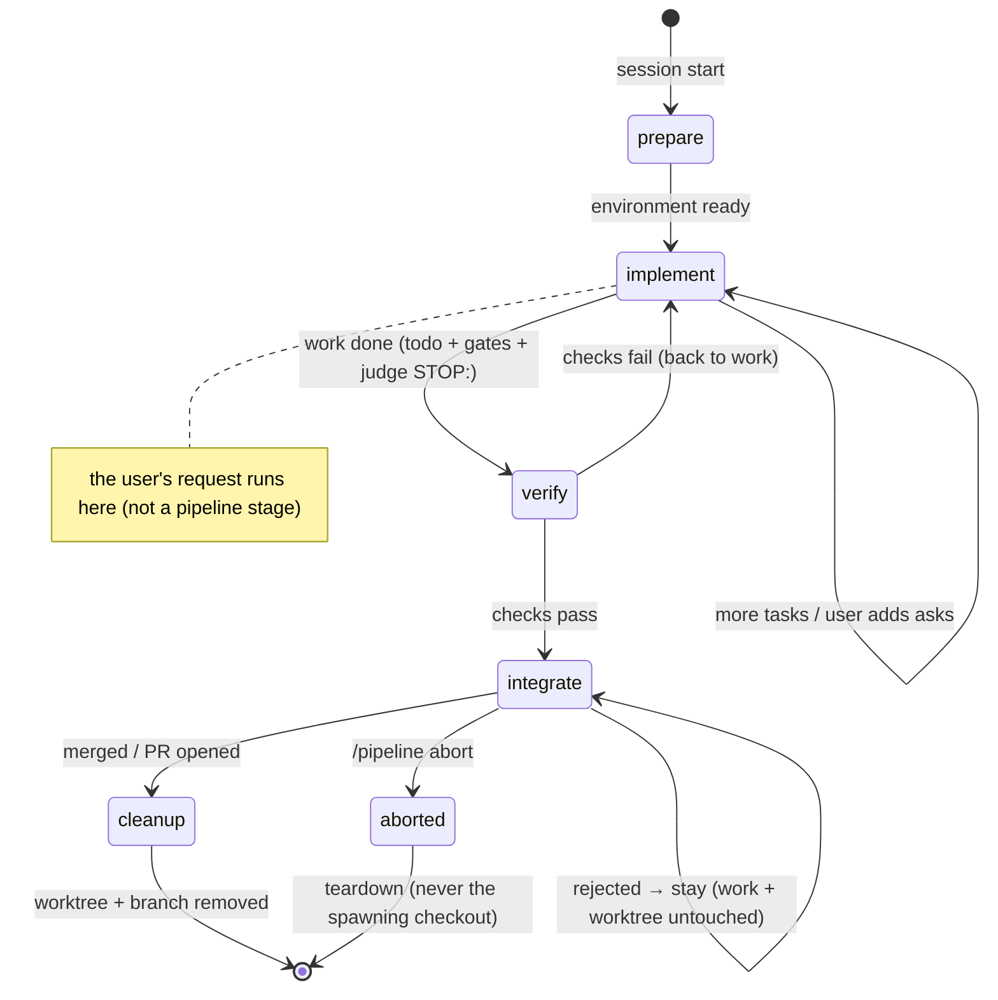
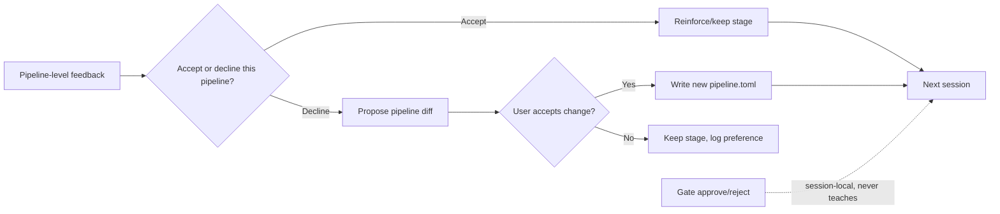

# Proposal: session pipelines for deterministic per-project session behavior

## Summary

Add a **session pipeline**: a declarative, CI/CD-like staged lifecycle that every
session in a given project follows deterministically. A pipeline is defined
per-project in `.jcode/pipeline.toml` (with a `~/.jcode/pipeline.toml` global
default) and is enforced by a **pipeline driver**, not merely described in
`AGENTS.md` or a prompt overlay.

A pipeline is a **mechanical envelope** of ordered **stages**, each bound to an
**action** and a **gate** (a condition that must hold before the next stage runs),
wrapped around the user's request (the work phase, which is not a stage). Sessions
run the envelope from start to finish; a persistent state file lets a resumed
session pick up at its current stage instead of starting over.

## Motivation

The user runs many projects and wants the same session workflow in each:

- Project A (a git repo, e.g. this jcode repo): `new worktree → do the asked
  tasks → wait for my approval → ff-merge into master → clean up worktree +
  branch`.
- Project B (a hosted repo with remotes): identical, but **create a PR** instead
  of `ff-merge master`.

Today that behavior can only be communicated via:

1. **Memory** ("user prefers worktrees + PR"). Vague, decays, and is not
   per-project precise.
2. **`AGENTS.md` / `.jcode/prompt-overlay.md`**. Advisory prose the model reads at
   prompt build (`crates/jcode-base/src/prompt.rs`,
   `load_agents_md_files_from_dir`, `load_prompt_overlay_files_from_dir`). There is
   no enforced lifecycle, no gate, and no cleanup guarantee.
3. **`pre_tool` gate hooks** (`docs/HOOKS.md`). Good for blocking individual tool
   calls, but they express no staged workflow, state, or lifecycle.

None of these give a session a structured, machine-enforced, observable pipeline
with persistent state. Memory is "vague" and prose is "advisory" — the user wants
something *reliable*.

## Architecture

### The pipeline is an envelope around the user's request

A pipeline does **not** contain the agent's work as a stage. `implement` is not a
declared stage — it is simply *the session's actual task*, the implicit center
that already happens in every jcode session (the agent does what the user asked).

The pipeline is the **mechanical envelope** around it. It wraps the user's
request with the lifecycle steps that should be *enforced*: set up an isolated
environment, let the request run, verify the result, integrate it (optionally
gated), and clean up. Every stage in the pipeline is a **mechanical,
driver-enforced `action`**; there is no free-text/agentic stage.

Runtime order: the request is the **trigger and payload** of the work phase. It
arrives, runs immediately after `prepare`, and the pipeline resumes at `verify`
once it is done. It is not a stage because the driver cannot do it and never
describes it. **When** the request runs, in sequence:

```mermaid
sequenceDiagram
    participant U as You
    participant D as Pipeline driver
    participant A as Agent

    U->>D: submit the request
    Note over D: [1] prepare — create_worktree (auto)
    D->>D: set up worktree + branch
    Note over D,A: [2] WORK PHASE — your request runs now
    D->>A: hand the request to the agent (your prompt verbatim)
    A->>A: do the work (builds todos, edits, tests)
    Note over A: auto-judge replies STOP: / CONTINUE:
    A-->>D: work complete (todo done + gates pass + judge STOP:)
    Note over D: [3] verify — run_checks (auto)
    D->>D: tests/lint; may loop back to phase [2]
    Note over D: [4] integrate — ff_merge (required)
    D-->>U: await your approval
    U-->>D: approve
    D->>D: ff-merge into master
    Note over D: [5] cleanup — remove worktree (auto)
    D->>D: tear down
```

Reading it as a timeline: numbered phases `[1] prepare → [2] work phase (your
request) → [3] verify → [4] integrate → [5] cleanup`, left-to-right falling
top-to-bottom. **The request is phase [2], sandwiched between `prepare` and
`verify`.** It is executed by the agent (not the driver), which is exactly why it
is not a pipeline stage.

The pipeline introduces two new pieces:

```
.jcode/pipeline.toml             per-project pipeline definition (project level)
~/.jcode/pipeline.toml            global default pipeline (global level)
jcode-app-core/src/pipeline/     (new) pipeline driver
  └─ definition.rs               parse + validate pipeline.toml
  └─ runner.rs                   stage executor: advance, gate, persist
  └─ state.rs                    serialized pipeline state
  └─ actions.rs                  built-in stage actions
```

The driver is the key idea: rather than praying the model "remembers" to branch
and clean up, the driver **forces** each stage's action and only advances on the
stage's gate.

### Declaration

Reuse the existing project-config layering convention (project dir + global dir),
matching how `AGENTS.md`, prompt overlays, and preferred-tools are resolved.

Every stage declares an `approval` — whether executing it needs human consent —
so approval is a **per-step property**, not a separate stage in the sequence:

```toml
# .jcode/pipeline.toml  (Project A: merge into master)
name = "standard-worktree-merge"
description = "Default session lifecycle with ff-merge into master"

[[stage]]
name = "prepare"
action = "create_worktree"          # set up the environment (worktree + branch)
approval = "auto"                   # creating a local worktree needs no consent

[[stage]]
name = "verify"
action = "run_checks"               # tests/lint; gate on success (optional: omit to flow straight to integrate)
approval = "auto"

[[stage]]
name = "integrate"
action = "ff_merge"                 # Project A: merge into master
target = "master"
approval = "required"               # merging is a human-approval gate

[[stage]]
name = "cleanup"
action = "cleanup_worktree_branch"  # remove worktree + local branch
approval = "auto"
```

This example *declares* `verify` because a merge-heavy repo wants a fresh
driver-run check before merge. `verify` is **optional** — a pipeline without
`verify` flows straight from the work phase to `integrate` (see "No stage is
mandatory").

Project B differs only in the `integrate` stage:

```toml
[[stage]]
name = "integrate"
action = "create_pr"                # Project B: PR instead of ff-merge
approval = "required"               # opening a PR still needs consent
```

There is **no `implement` stage in the file**. The user's request runs in the
prepared environment after `prepare`, and the pipeline resumes at the next
declared stage (a `verify` if present, else `integrate`) once the work is done
(see Runtime placement & hand-off). A pipeline author cannot and does not need to
describe the agent's work.

### Stage actions

Every pipeline stage is a **mechanical `action`** the driver enforces from a
finite, trusted set. A stage `name` is a semantic label; its `action` is the
mechanical operation the driver performs:

| action (mechanical) | typical stage | behavior |
| --- | --- | --- |
| `create_worktree` | `prepare` | set up a worktree + branch as the session's working environment, before the user's request |
| `run_checks` | `verify` | invoke configured test/lint commands; gate on exit 0 |
| `ff_merge` | `integrate` | fast-forward merge into `target` |
| `create_pr` | `integrate` | open a PR via the remote host instead |
| `cleanup_worktree_branch` | `cleanup` | remove the worktree + branch created by `prepare` |

**Mechanical actions must have a native driver implementation.** jcode today has
no git library dependency and performs git operations only through the agent's
`bash` tool. For `ff_merge`/`create_pr`/`create_worktree`/`cleanup_worktree_branch`
to be *driver-enforced* (not delegated to the model), the driver needs its own
path to git — either a small native plumbing module that shells out to `git`
(spawn `git merge`, `git worktree add/remove`, `git push`, or `gh pr create`) or a
git library dependency. This is a real pre-requisite for Slice 2 (the action
implementations): without it, the "mechanical action" is quietly another agent
bash call. Decide this at the start of Slice 2, not deferred.

**Auth is not owned by the pipeline.** jcode's auth crates cover model providers
(OpenAI/Anthropic/Azure), not git hosts. So `create_pr` depends on the **user's
pre-existing `gh` CLI auth** (their `gh` is already logged in to the remote), and
`push` relies on their configured git credentials/SSH. The driver shells to
`gh`/`git` and uses whatever the user has set up; it does not manage git-host
credentials. If `gh` isn't installed or authenticated, `create_pr` fails with a
clear error rather than prompting — document that dependency and surface it, don't
try to authenticate on the user's behalf.

**No stage is mandatory.** A pipeline is exactly the stages you declare, in the
order you declare them; there is no implicit `prepare`/`cleanup` that always runs.
Omission is meaningful, not a bug:

- omit `cleanup` → the worktree + branch are left in place (keep the work);
- omit `integrate` → stop after the work phase (and any declared `verify`), never
  merge/PR;
- omit `prepare` → work in the current checkout, no isolation.

Stages run in declared order, with one structural constant: the work phase (the
user's request) sits between whatever stages precede it and those that follow.
A declared `cleanup` still runs last even if `prepare` is absent. `prepare` is
only "before" in the sense that any real setup precedes the work phase; a stage
runs mechanically only if you listed it. There is no agentic / free-text stage.
The driver only performs mechanical operations; the agent's work is the user's
own prompt, which is not part of the pipeline definition.

**Safety rule for optional `prepare`/`cleanup`.** `cleanup` must never remove the
spawning checkout. It may only tear down an environment that a `prepare` in the
*same* pipeline actually created (tracked in state). If `prepare` was omitted and
work ran in the current checkout, a `cleanup` stage either no-ops or is rejected
as misconfigured — it must not risk deleting the user's real checkout. The driver
keys cleanup to a recorded `prepare`-created artifact and refuses to run it
against anything else.

**Autoreview/autojudge belong to the work phase, not a `verify` stage.** jcode's
autoreview (`/autoreview`, feature-flag `autoreview.enabled`) spawns a read-only
reviewer/judge subagent that inspects the finished diff and replies `STOP:` /
`CONTINUE:` (or "No issues found"). Because its job is deciding *whether the work
is done*, it is part of the **work phase** — it consumes the same completion
machinery that determines the work-done signal (see Runtime placement & hand-off).

So the work phase already includes the checks: the agent runs tests/lint as part
of *doing* the work, and the judge confirms the work is done. **There is no
implied `verify` stage.** Running tests is not a separate thing the envelope does
afterward — it is what a good agent does during `implement`.

`verify` (a `run_checks` action) exists only as an **optional, declared** stage
for users who want a *fresh, driver-run* check after all the agent's edits settle
— e.g. a project that enforces "the worktree must be CI-green before merge," run
separately from the agent's own test runs. Users who find it redundant simply omit
it, and the flow is just `implement → integrate`. The action vocabulary stays the
same; `verify` is just not implied.

The three verification-ish layers stay distinct: the todo quality gates
(private/in-process), autoreview/autojudge (judgment, part of the work phase), and
the human `required` gate at `integrate`. A declared `verify` sits between the work
phase's done-signal and the `integrate` gate as an optional deterministic safety
net.

The **session working directory is bound to the environment** from `prepare`
onward: the driver sets the worktree as the session's cwd, so the user's request
work and every tool that acts on the repo operate inside the worktree, never on
the checkout that spawned the session. This is what makes the isolation real
rather than cosmetic.

Approval is not an action here; it is the `approval` attribute set per stage.
The driver inserts a gate between stages based on that attribute: an
`approval = "required"` stage may not begin (or its side-effect may not be
committed) until the user approves, and the flow blocks there.

### State machine



A `required` stage shows as blocked until approval. **Reject** at a `required`
gate means "don't do this step now": the pipeline **stays** where it is (the work
and worktree are untouched), and the user can keep working, adjust, or close the
session themselves. Rejecting a merge never terminates the pipeline nor discards
the work — it only declines that specific integration.

The diagram above shows the **full Example-A envelope**. In a real pipeline any
stage may be absent: if `cleanup` is omitted, the state is complete at `integrate`
and the worktree stays; if `verify` is omitted, checks never run; and so on. The
driver advances through whatever stages are declared.

```mermaid
sequenceDiagram
    participant D as Pipeline driver
    participant U as User
    D->>D: reach integrate (approval=required)
    D-->>U: request approval: "ff_merge into master?"
    alt approve
        U-->>D: approve
        D->>D: try ff_merge
        alt base moved
            D->>D: update target into the branch
            D-->>U: re-request approval for the now-synced merge
            U-->>D: approve
        end
        D->>D: run integrate
    else reject
        U-->>D: reject
        D->>D: stay at integrate; work + worktree untouched
    end
```

**Reject ≠ abort.** Rejecting a gate only declines that step and leaves the
session live. Only an explicit **`/pipeline abort`** (a teardown command) or the
`cleanup` stage removes the worktree + branch. Abort is destructive (it teardowns
what `prepare` created, under the same safety rule — never the spawning checkout);
reject is non-destructive and reversible.

A serialized state file records progress so resumes continue in place. This is a
**mid-run snapshot** (`prepare` done; the user's request work is complete;
`verify` done; `integrate` is blocked awaiting approval; `cleanup` has not run
yet). `implement` is tracked as the work-phase status, not as a stage with an
`approval`:

```json
{
  "pipeline": "standard-worktree-merge",
  "current_stage": "integrate",
  "current_stage_status": "awaiting_approval",
  "started_at": "2026-08-26T07:40:00Z",
  "worktree": "/path/to/.worktrees/session-x",
  "branch": "jc/session-x",
  "work_phase": "done",
  "steps": [
    { "stage": "prepare",   "status": "done",    "approval": "auto" },
    { "stage": "verify",     "status": "done",    "approval": "auto" },
    { "stage": "integrate",  "status": "blocked", "approval": "required" },
    { "stage": "cleanup",    "status": "pending", "approval": "auto" }
  ]
}
```

### Integration with existing systems

- **Hooks** (`docs/HOOKS.md`): the driver emits a new `pipeline_stage` lifecycle
  event in addition to the existing `turn_end`/`session_end` points, so external
  observers can watch stage transitions. No new hook framework is needed.
- **`pre_tool` gate** remains for low-level tool policy; the pipeline operates one
  level up and governs *stages*, not individual calls.
- **AGENTS.md / overlay** describe *why* a pipeline exists; the pipeline defines
  *what must happen*. Complementary, not competing.
- **Safety / approval** (`docs/SAFETY_SYSTEM.md`): stages marked `approval = "required"` re-use the *concept* of permission-gating that ambient's `request_permission` establishes ("never act without consent"), but the mechanism differs: `request_permission` is an ambient agent-facing tool, whereas a pipeline `required` gate is a **server-enforced UI block**. Code changes already follow "worktree + review" in ambient; this generalizes that pattern to every session.
- **Per-project config precedent** (`docs/AMBIENT_MODE.md`): the existing
  per-project `[ambient]` block shows the project-scoped behavior pattern; the
  pipeline file is a more structured variant.

### Observability

The todo widget **becomes the pipeline widget**. The existing todo UI — the
inline `card` (`/todos`), the `pinned` band, and the side-panel `page` — already
renders the todo/goal/plan stack from `build_todos_view_markdown` /
`todo_card_payload_json`. Since the work phase (the user's request) *is* the todo
list, the pipeline is shown by **decorating that same widget with a pipeline
header**, not by adding a parallel panel:

```
# Pipeline: worktree-merge

▸ [1/4] prepare     (auto)      ✓ done
  ── user's request ──          ● in progress   (work phase, not a stage)
▸ [2/4] verify      (auto)      ○ pending
▸ [3/4] integrate   (required)  ○ pending   ← user gates here
▸ [4/4] cleanup     (auto)      ○ pending

## In progress
- [doing] review proposal
- [todo]  apply review fixes
```

Concretely, the three render call sites (`todo_card_payload_json`,
`build_todos_view_markdown`, `hash_todos_payload`) gain access to the session's
pipeline state (same storage dir as the todo files) and:
- prepend the stage list with the active stage highlighted and `required` gates
  marked distinctly from todos;
- render the user's request work (the todo list) beneath the pipeline spine;
- hash the pipeline pointer so the widget live-refreshes when a stage advances.

Design rules:
1. `/todos` stays the command; `/pipeline status` remains a verbose text form.
   No parallel UI.
2. Only the **current stage's** approval status is visually emphasized; the rest
   are dimmed.
3. A `required` gate is rendered as a blocking server gate (e.g. `⏳ awaiting
   approval`), never as a `[doing]`-style todo.
4. Until a pipeline exists (bootstrap), the widget renders as the plain todos
   list it does today — unchanged.
5. TUI status line: `pipeline: standard-worktree-merge ▸ integrate (awaiting approval)`.
6. `required`-stage approvals accept `[a] approve` / `[r] reject` from the UI.

### Learning & adaptation (approval-driven)

A pipeline is **not a frozen config**. It should behave like a convention that
learns: the user's *pipeline-level* decisions are the teaching signal, and
accepted changes become the new default so the next session behaves differently.

**Gate-approval is not config feedback.** Approving a `required` gate (e.g. `[a]
approve` at `integrate`) only lets that *specific* merge happen — it says
nothing about whether the pipeline is right. A user can approve a merge to
unblock while disliking the flow. So gate verdicts are **session-local and never
teach the pipeline.** The learning loop keys only on explicit, config-level
decisions about the pipeline itself.

Four concrete signals, where only the last two reach the pipeline config:

| Signal | Meaning | Teaches the pipeline? |
| --- | --- | --- |
| **Approve a gate** | "let this step run" | no — session-local, completes the current step |
| **Reject a gate** | "don't run this step now" | no — session-local, leaves the session live |
| **Decline the pipeline** | "this workflow step is wrong for this project" | yes — record a proposed diff |
| **Accept a pipeline change** | "yes, change the pipeline this way" | yes — persist the diff → future sessions adopt it |

The learning loop is triggered by explicit pipeline feedback, not by routine gate
activity. For example, the user declines the `create_pr` **action** at the
`integrate` **stage** for this project ("switch it to `ff_merge` going forward?
(y/n)"). Implementation: the driver surfaces a proposed delta on a *pipeline-level*
decline (available as an explicit action, not inferred from a gate rejection), and
writes the new stage into `pipeline.toml` (or a `~/.jcode/pipelines/<profile>.toml`
overlay if the user wants it globally). This is the same feedback mechanism
ambient uses for approval/rejection memory (`docs/AMBIENT_MODE.md`, "User
Feedback via Memory") but made *structured* and *acted upon* instead of vague:



Why this matters: the failure mode of a *static* config is exactly what the user
is escaping today — a convention that stops matching their real preferences and
quietly drifts out of sync with how they work. Approval-driven learning keeps the
pipeline honest; and by excluding routine gate approvals, it learns *intent*
correctly rather than treating every "yes, proceed" as a pipeline endorsement.

### Runtime placement & hand-off

The proposal above says the driver "forces" stages, but does not say where the
driver lives or how the model hands back between stages. This is the crux:

- **Where the driver runs.** The pipeline driver lives in the **server** (the
  long-lived process that already owns worktrees and edits via `FileTouchService`
  and mediates conflicts). It owns the pipeline state file, creates and binds the
  worktree, runs `required`-gate approval, and advances on verdicts. The model
  does not "follow" the pipeline from a prompt; it is a server-enforced policy.
- **Who advances a stage.** Each stage's exit condition must be observable. A
  mechanical action advances on its gate (e.g. a declared `verify`/`run_checks`
  advances on exit 0; `wait_approval`/`required` advances on an explicit
  user verdict, and the work phase (`implement`) completes when the model signals
  a task is done. The model does not move the pointer by itself — it calls the
  existing `todo` tool to mark work complete. The driver does **not** poll the
  todo list; it is invoked at the **`turn_end` lifecycle point** (which already
  fires for every streaming turn, see `turn_execution.rs::fire_turn_end_hook`)
  and evaluates the work-done conjunction there to decide whether to advance.

**How the driver knows the work phase is done** — the one place the driver must
judge agent output rather than read a mechanical signal. Rather than a
hand-rolled "is it done?" heuristic, reuse jcode's existing completion machinery,
which already decides this for every session:

1. **Todo completion gates** (`todo.rs`): the turn-end gates
   (`completed_groups_have_sufficient_delivery`, the intent/ownership/completion
   digest) already force the agent to re-check before a turn can be treated as
   finished. If a group is not genuinely done, the gate sends the agent back.
2. **Auto-poke**: `build_auto_poke_message(incomplete_count)` ("you have N
   incomplete todos") re-engages an agent that stopped too early.
3. **Autoreview / autojudge** (`commands_review.rs`): the reviewer subagent
   inspects the finished diff and the judge replies with a `STOP:`/`CONTINUE:`
   verdict. A `CONTINUE:` means "not actually done — keep going"; only a `STOP:`
   (or an autoreview "No issues found") is the strong, independent "work is done"
   signal.

So the work phase is **done** when: the todo list is complete (a todo `group`,
or the implicit ungrouped goal for a flat list — the todo system treats
`group: None` as the single implicit goal) **and** the
turn-end gates pass **and** (if enabled) the judge answers `STOP:` — i.e. the
system itself already believes the work is finished. The driver advances to the
next declared stage (a `verify` if present, else `integrate`) only on that
conjunction, not on the model merely stopping. This closes the gap I flagged in
review: the driver never trusts "the agent said it's done", it trusts the same
multi-part evidence jcode already uses.

- **Hand-off contract.** The driver surfaces the current stage as the session's
  environment (working directory = worktree, plus a pipeline-context field), and
  exposes the stage list and current pointer via `/pipeline status` and hook
  events. The model works within the stage; the driver owns the transitions.

Without this placement, "driver enforces" is just another phrase that means
"hope the model obeys". Stating that the server owns the state and gates is what
makes enforcement real.

### User turn → stage transition

The driver enforces stages, but the user is typing prompts the whole time. The
mapping between user turns and stage state must be explicit:

- **Most prompts are work, not instructions.** A new request, a correction, or a
  "please also..." feeds the work phase (`implement`). It does not advance the
  pipeline; it extends the current work.
- **Approval is a distinct, explicit action.** Only an explicit approval (a
  `[a] approve`/`[r] reject` response at a `required` gate, or `/pipeline
  approve`) advances a `required` stage. A free-text "yes looks good" must not be
  treated as a gate verdict — it is recognizably work input, not a structural
  `approve`. (Server-side, an approve is a structured message, never a guess from
  free text.)
- **Stage changes are a side effect of evidence.** The work phase completes when
  the todo group is done; `verify` advances on exit 0; a `required` gate advances
  only on an explicit verdict. The user does not normally type a stage transition
  directly — the exception is `/pipeline run <stage>`, a deliberate manual override
  (e.g. force-advance, or jump to a stage) that a power user invokes explicitly.

This distinction is what keeps gates honest: **the model cannot approve its own
gate by writing a prompt that sounds approving.** An approval is a server-side
event, not text.

### Connection to the existing todo system

jcode already has a rich, persistent, per-session **todo/goal/plan** system
(`crates/jcode-base/src/todo.rs`, data model in `crates/jcode-task-types`). The
pipeline should **reuse it rather than invent a competing plan format**:

- **The work phase maps onto the todo list.** A pipeline session's task work
  is exactly the todo/goal/plan stack: the model builds a `plan` (user
  intention + understands intent), `goals` with feedback-loop and delivery
  assessments, and `items`. The driver treats a completed todo group as the
  work phase's completion condition, rather than a hand-rolled "is it
  done?" heuristic.
- **The pipeline state rides alongside todo state.** The serialized pipeline
  pointer can live in the same per-session storage layout, keyed by session id
  like `todos`, `goals`, `plan`, and `gate-observations` already are. This also
  gives resume-from-state for free: a resumed session reloads its pipeline
  pointer the same way it reloads its todos.
- **Reuse confidence, not reintroduce it.** The todo system already tracks
  `confidence`, `completion_confidence`, `confidence_history`, and goal-level
  feedback-loop/delivery assessments with difficulty-calibrated bars. A pipeline
  stage like `verify` can re-use a goal's `delivery_state` + feedback-loop fields
  as part of its gate, rather than the pipeline defining its own "is this good
  enough?" scoring.
- **The display-summary technique is reusable, but the auto-poke semantics are
  not (correcting an earlier overclaim).** The todo machinery has a library of
  synthetic auto-poke continuations and user-facing summaries
  (`build_auto_poke_message`, `is_auto_poke_message`,
  `auto_poke_display_summary`). A `required` pipeline stage pending human approval
  can reuse the *rendering* idea — a short user-facing line for "awaiting
  approval" — but it is **not** an agent auto-poke. An approval wait is a blocking
  human gate, not a "nudge the model to continue" continuation, so it must *not*
  be fed through `is_auto_poke_message` detection or persisted as a model-facing
  continuation. Reuse the short-notice UX; keep the approval gate a distinct,
  server-side wait.

So the pipeline is not a parallel planning system. It is a **lifecycle
orchestrator that loops the todo/goal/plan stack into a per-project sequence**:
the model plans and tracks with the familiar todo system, and the pipeline
orders, gates, and persists the surrounding SCM lifecycle around it.

### Bootstrapping: propose the first global pipeline

There is no hardcoded "default" pipeline shipped with jcode. The **first global
pipeline is proposed from observable project structure, then confirmed by the
user's explicit accept/edit/decline**, rather than shipped invisibly or inferred
from gate approvals (the same principle as the Learning section).

On a fresh install (or in a project with no `pipeline.toml`), the driver starts
with a minimal fallback — a permission-only envelope with no `required`
approvals, so it only prepares, runs the user's request, verifies, and reports
but never merges/pushes on its own — and it is ready to propose an initial
pipeline. It does **not** infer a pipeline from gate approvals (approving a merge
only means "do it now", not "I want this workflow" — the same principle as the
Learning section). Instead it forms an **initial proposal** from observable
structure (is there a remote? is it a hosted repo? does the user open PRs?), and
the teaching signal is the user's explicit accept/edit/decline:

1. **Synthesizes a proposed global pipeline** (`~/.jcode/pipeline.toml`) from that
   structural observation, including inferred `approval` flags per stage;
2. **Notifies the user** and shows the proposed definition, e.g.:

   > No pipeline exists yet. Based on this repo (has a remote, PR-oriented) I'd
   > propose:
   > `prepare(auto) → verify(auto) → ff_merge master(required) → cleanup(auto)`
   > Accept, edit, or decline? (/pipeline accept | /pipeline edit | /pipeline none)

3. Asks explicitly whether to **accept, edit, or decline** before any persistent
   pipeline takes effect. Nothing global is written or enforced without that
   explicit consent.

Principles:

- **Proposed, never silent.** A global pipeline is never created or changed
  invisibly. It is proposed (from structure), then surfaced for the user's
  explicit accept/edit/decline. The proposal offers; the user disposes.
- **Observational, not gate-driven.** The initial proposal comes from observable
  project structure (remote present? hosted? PR-oriented?), not from the user's
  gate approvals. Gate approvals are session-local and teach nothing (Learning
  section).
- **Per-project can outrank the global default.** A `./.jcode/pipeline.toml`
  always overrides the global proposed one, so a project that differs (the
  merge-vs-PR example) is never forced to follow the global shape.
- **The minimal fallback is permission-only.** Before a pipeline is proposed and
  accepted, every stage is `auto` except a built-in safety default that is
  `required` for anything irreversible (merge/push/PR) — so the unbootstrapped
  state prepares, works, verifies, and reports but never merges or pushes on its
  own.

This makes the whole lifecycle a single, coherent story: **bootstrap by
structural proposal, confirm into existence with explicit consent, and refine
forever via explicit pipeline-level accept/reject** — gate approvals never drive
any of it.

### Linearity vs branching

Most sessions are a linear run of a fixed pipeline. Some need branch points
(verify passed → merge vs PR; or conditional stages). v1 stays **linear** (some
stages can be optional/disabled per project). Conditional branching is left as a
future extension, aligned with `docs/AGENT_NATIVE_VCS_CORE_BEHAVIOR.md`
(lanes/maintenance direction).

## Comparison: why not just AGENTS.md?

| | AGENTS.md / overlay (today) | Pipeline (proposal) |
| --- | --- | --- |
| Enforced? | advisory prose | structured, staged, gated |
| State | none | persistent state file, resumable |
| Gate on approval | "please ask me" hope | hard block + TUI surface |
| Per-stage visibility | none | `/pipeline status` + hook events |
| Cleanup guarantee | usually forgotten | dedicated final stage |
| Per-project variant | manual duplication | merge vs PR via one stage swap |

## Relation to the VCS draft

`docs/AGENT_NATIVE_VCS_CORE_BEHAVIOR.md` is a larger, long-term vision about
lanes, draft patches, and maintenance packets. Session pipelines are a narrower,
near-term, user-facing mechanic that shares its spirit:
- **worktree-isolated work** fits "no anonymous dirty state / owned draft work";
- **staged lifecycle** is a governance layer the VCS draft does not specify.

They can compose (a pipeline could later target a lane on top of a worktree), but
this proposal intentionally does not depend on the VCS draft.

## Implementation plan

Sliced so the **core mechanism ships first** and action implementations,
learning, and bootstrapping come later. Slice 1 is the driver *engine* — it can
parse a pipeline, advance stages, run `required` gates, persist state, evaluate
work-done, and surface status — **without implementing any real action**. The
mechanical actions (git worktree, checks, merge, PR, cleanup) are added in
Slice 2. This keeps core independent of the git/host specifics.

### Slice 1 — core engine + observability (internally testable)

The driver engine + observability, with no concrete action interpreters. It can
run a pipeline structurally and block on a `required` gate; action bodies arrive
in Slice 2. This is a **testable internal milestone**, not yet an end-user feature:
a session can run the envelope and observe gates/state, but no real action
(merge/PR/worktree/checks) executes until Slice 2.

1. Define the `pipeline.toml` schema in `jcode-config-types`.
2. Implement the **server-side pipeline driver engine**: parse the file, advance
   stages in declared order, run `required`-gate approval (server-enforced,
   structured `approve`/`reject`), and persist state alongside the existing todo
   state. Actions are represented as an enum/registry but **not yet implemented** —
   the engine dispatches to a body that Slice 2 fills in.
3. Hook the driver into the existing `turn_end` lifecycle point (event-driven, no
   polling): at each turn end, evaluate the work-done conjunction (todo group
   complete + turn-end gates pass + autojudge `STOP:` **if the per-session
   `autojudge_enabled` flag is set**) and advance to the next declared stage.
   Autojudge-off is just a normal configuration (the user has no judge for this
   session), so the conjunction simply omits the judge term — it is not a
   "fallback" or a weaker-state decision the system has to reconcile.
   (Depends on the gate state machine from step 2 being complete.)
4. Add the `pipeline_stage` lifecycle hook event so external observers can watch
   stage transitions.
5. Add `/pipeline status`, `/pipeline run`, `/pipeline none` slash commands.
6. **Widget** — decorate the existing todo card/band/page so the pipeline spine
   shows above the work-phase todo list (prepend stages, highlight the current
   `required` gate, live-refresh on stage change). This makes a `required` gate
   and an unattended `auto` merge unmissable.
7. Add the merge-vs-PR example pipeline *definitions* (the `.toml` files, not
   their action bodies) to prove the schema.

**Slice 1 is usable only with stubs: `integrate`'s merge/PR, `prepare`'s
worktree, `verify`'s checks, and `cleanup` are stubbed during Slice 1.** A session
can run the envelope and observe gates/state, but the actions themselves are
deferred. If Slice 1 must be independently useful, pick one trivial action to
implement as a proof (e.g. `run_checks` invoking `git`-free commands) and stub the
git-dependent ones.

### Slice 2 — mechanical action implementations

Add the real driver-enforced bodies for each action, on top of the git plumbing.

8. Native **git-plumbing module** (shell out to `git`/`gh`, or take on a git
   library) — the base for the git actions. Handle git-host auth as documented
   (fail clearly, don't prompt).
9. Implement actions on that base: `create_worktree` (prepare),
   `cleanup_worktree_branch` (cleanup), `run_checks` (verify, if declared),
   `ff_merge` and `create_pr` (integrate). Each is a native, driver-enforced
   mechanical body — never a second agent bash call.
10. **Abort discovery** — `/pipeline abort` is destructive teardown; before it
    runs, print what it is about to remove (worktree path, branch, that it was
    `prepare`-created) and require confirmation. A rejected gate keeps everything,
    so nothing is lost on reject.

### Slice 3 — learning & bootstrapping (v2)

These two are somewhat orthogonal: the learning loop records approve/reject
history to refine an *existing* pipeline, while bootstrapping *proposes* the
first one from observable structure before any history exists. Both are
deliberately v2 / deferred.

11. Add the approval-driven learning loop: record approve/reject signals, propose
    pipeline diffs, and offer to persist them into `pipeline.toml` for future
    sessions.
12. Bootstrapping: propose a first global pipeline from observable project
    structure, surface it for accept/edit/decline. This is the hardest,
    least-certain part and is deliberately deferred.

## Open questions

- **Native git plumbing for mechanical actions** — jcode has no git library
  dependency and runs git only via the agent's `bash` tool. For the driver to
  *enforce* `create_worktree`/`ff_merge`/`create_pr`/`cleanup_worktree_branch`
  rather than delegate to the model, it needs its own git path: a small native
  module that shells out to `git`/`gh`, or taking on a git library. This is a
  prerequisite for the Slice 2 action implementations, not the Slice 1 core engine.
- **`gh` / git-host auth dependency** — `create_pr` shells to the user's `gh` CLI
  and `push` uses their git credentials/SSH. jcode does not own git-host auth. The
  pipeline must fail clearly (not prompt) if `gh` is missing/unauthenticated; a
  project that needs PRs should be able to declare that dependency upfront so the
  error is caught early rather than at the merge step.
- **Autojudge-off is just config, not a scenario (resolved)** — the work phase
  "done" conjunction includes the judge `STOP:` only when the per-session
  `autojudge_enabled` flag is set. With it off, the conjunction is todo-done +
  turn-end-gates. There is no separate "fallback"; `integrate`'s own `approval`
  value independently governs the merge gate. The only standing requirement is
  observability (an `auto` merge is surfaced before it runs), which the widget
  and `notify_session` cover — see Observability. This is not an open design
  question.
- **Per-session override — the "no envelope at all" case.** Some sessions should
  opt out entirely for a specific run (`/pipeline none` or `--no-pipeline`),
  distinct from omitting individual stages in a pipeline. Define the escape hatch:
  `/pipeline none` means run the request with no lifecycle stages, just like
  today's default session.
- **Where the worktree lives (resolved)** — **git-native** under
  `.git/worktrees/<name>` (branch-owning, already detected by
  `git_common_dir_for`). This is distinct from `JCODE_SCRATCH_DIR`, which is
  for run-time temp files (RAM-backed, for large/bash scratch) and would be wrong
  for a branch-owning worktree you want to survive the session. So `prepare`
  uses git worktrees; the scratch dir stays for transient tool temp.
- **Project variance is config, not a new mechanism** — projects differ beyond the
  merge-vs-PR swap (target branch, test command, remote host, whether to open a
  PR at all). These are all just per-project `pipeline.toml` values (`target`,
  `run_checks` command, `create_pr` vs `ff_merge`). No new stage kind is needed
  for variance; the schema's action vocabulary + per-project file already covers
  it. Confirm the config makes these fields overridable without forking the model.
- **PR branch naming** — derive from session id (`jc/<session-short>+<slug>`).
- **Approval UX (resolved)** — the model must not be able to approve its own gate;
  the gate is server-enforced, not just instructed. When a `required` gate is
  reached, the UI surfaces the gate **with a diff preview** (for `ff_merge`) or the
  PR body (for `create_pr`) alongside the `[a] approve` / `[r] reject` prompt, so
  approving is never a blind action. An approval is a structured server-side
  event, never a guess from free text.
- **Multi-session concurrency in one project** — two sessions creating worktrees
  on `master` must not collide; key the worktree/branch by session id.
- **Non-git projects** — pipeline stages assume git. Non-git projects get a
  reduced envelope (`prepare`/`cleanup` only, no `integrate`, and `verify` only if
  there are checks to run; irreversible steps still `required`), or no pipeline.
- **Per-stage approval inference** — during bootstrap, how does the driver guess
  which stage should be `auto` vs `required`? Default rule: never infer `auto`
  for anything irreversible (merge/push/PR); default those to `required` and let
  the user relax them to `auto` explicitly. Do not silently infer "auto" for a
  potentially destructive stage.
- **Learning threshold** — how many reject/approve signals before proposing a
  pipeline change vs proposing immediately? Should one rejection always prompt a
  diff, or only a repeated pattern? Keep v1 honest: propose on every rejection,
  persist only on explicit approval.
- **Learning scope** — should a learned change apply to just this project, or
  become a global `~/.jcode/pipelines/<profile>.toml` behavior shared across
  repos? A per-project default, with an explicit opt-in to globalize, avoids
  silently changing unrelated projects.
- **Bootstrap timing** — how soon should the driver offer a first pipeline
  proposal after it detects a repo's structure (e.g. immediately on a fresh
  project, or after a couple of sessions)? Too prompt → noisy; too delayed → the
  user does manual setup longer than needed. This is about *when to propose*, not
  about accumulating gate-approval evidence.
- **Editing a proposal** — when the user chooses `/pipeline edit`, is that an
  inline TOML edit surface, or a pick-from-known-stages menu? The editable form
  affects how much scaffolding the `/pipeline edit` command needs.
- **Bootstrap vs per-project override ordering** — if a project already has a
  `./.jcode/pipeline.toml`, the global proposal must not overwrite or double-prompt
  for it. Confirm per-project always wins and suppresses global proposal for that
  repo.
- **`notify` approval value** — is a run-then-inform (non-blocking) stage useful in
  v1, or does it add a third concept without a clear consumer? Default: defer
  `notify` to a later pass and keep only `auto`/`required` in v1.
- **Two distinct "reject" meanings** — rejecting an integration *gate* (decline
  the step, session stays live, work + worktree untouched) is separate from
  rejecting a *pipeline change* (decline updating `pipeline.toml`, but the current
  session still runs normally). Both are non-destructive. Only `/pipeline abort`
  or the `cleanup` stage is destructive teardown. Keep all three clear in the doc
  and the implementation.
- **User turn → stage transition** — is an approval always a structured action
  (`[a] approve` / `/pipeline approve`), or can a natural-language "yes, looks
  good" ever advance a gate? Decision: keep it structural; free text is always
  `implement` input, never a gate verdict. Confirm this in the implementation.
- **Merge base drift** — strict `ff_merge` fails if `target` moved since the
  worktree was created. Decide the default: block for a manual base update, or
  fall back to a non-FF merge (which itself needs approval). Confirm the
  `integrate → integrate` re-approve loop in the state machine.